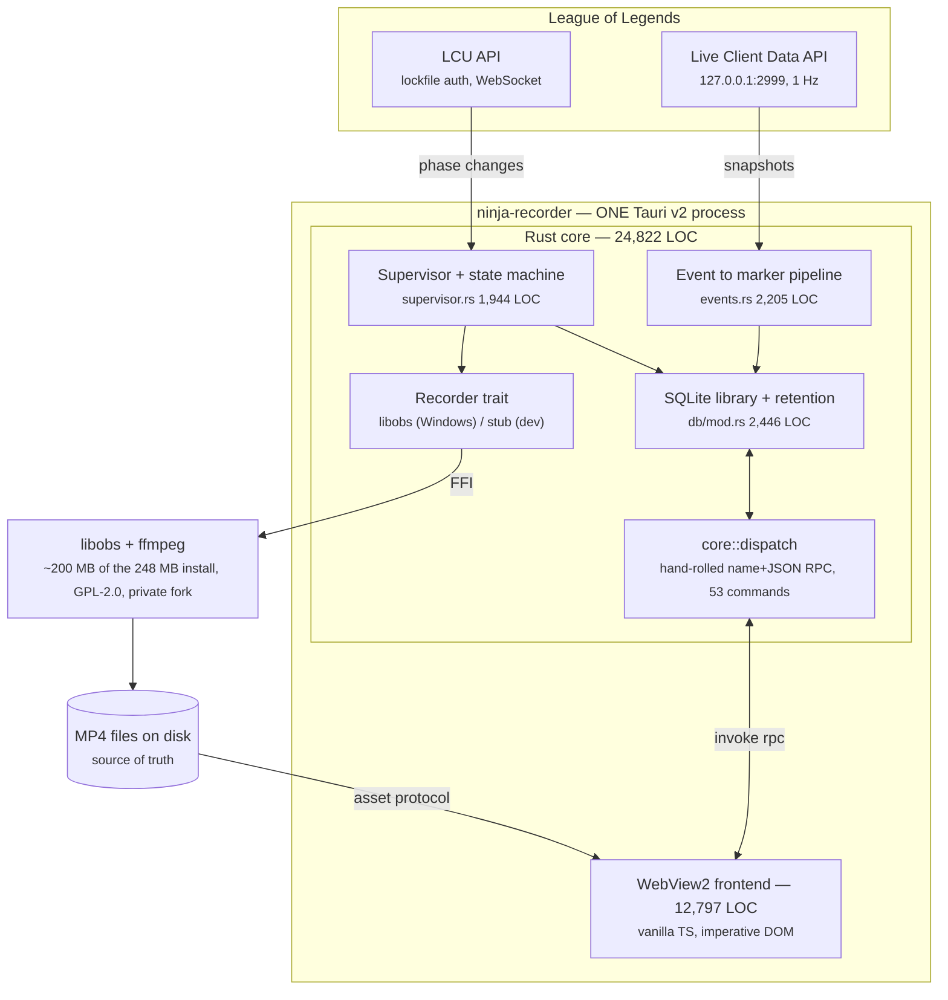
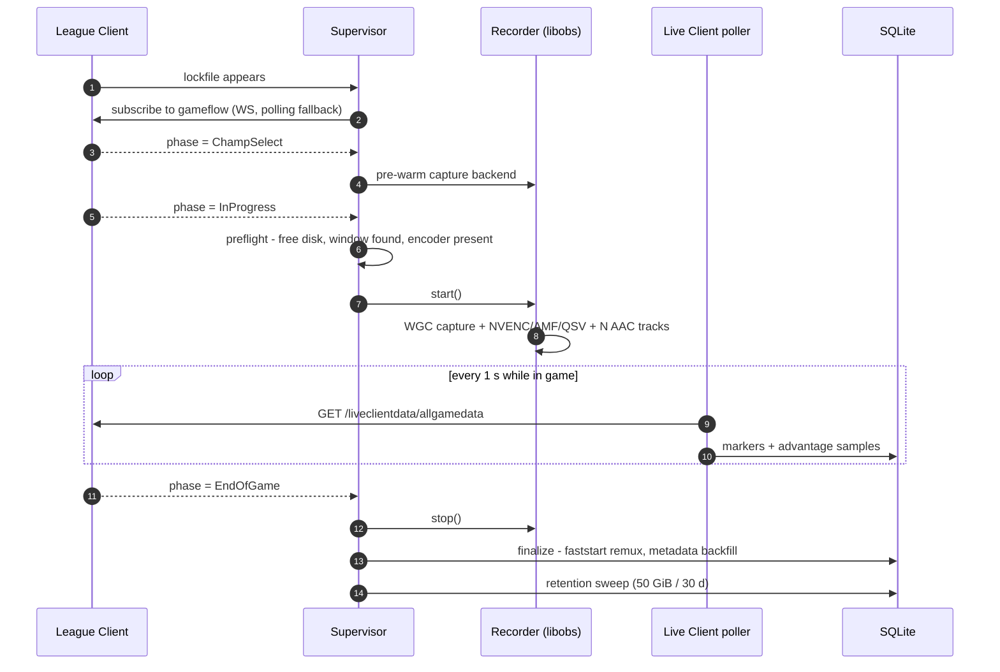
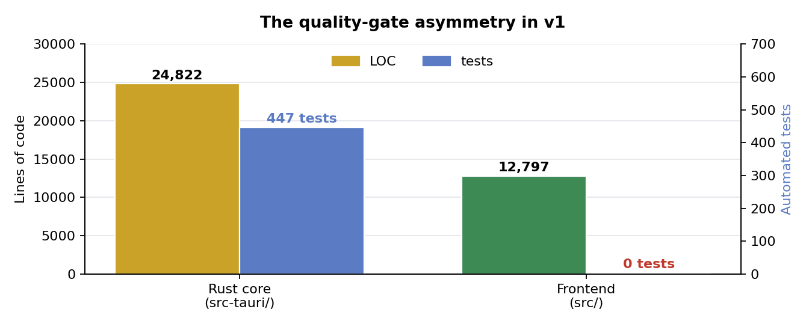
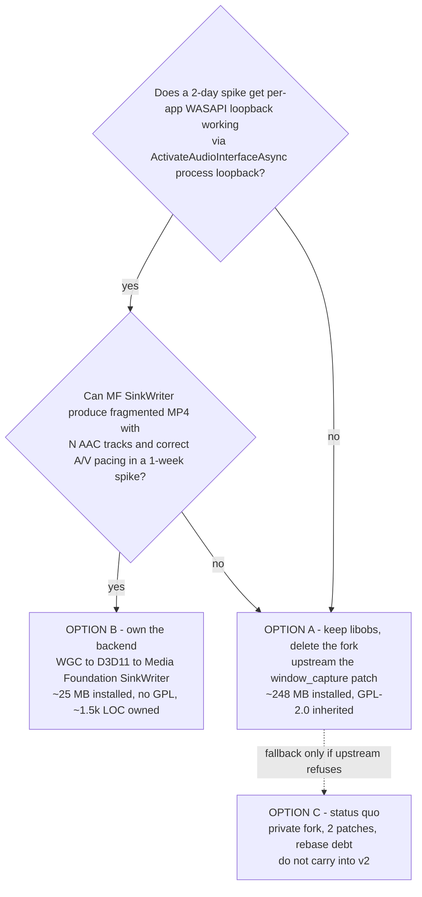
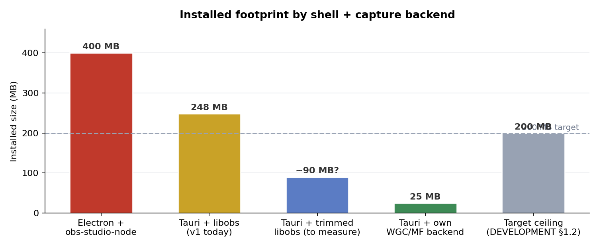
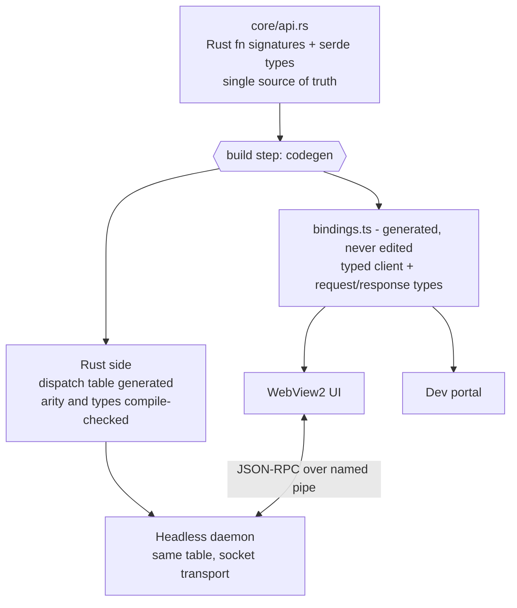
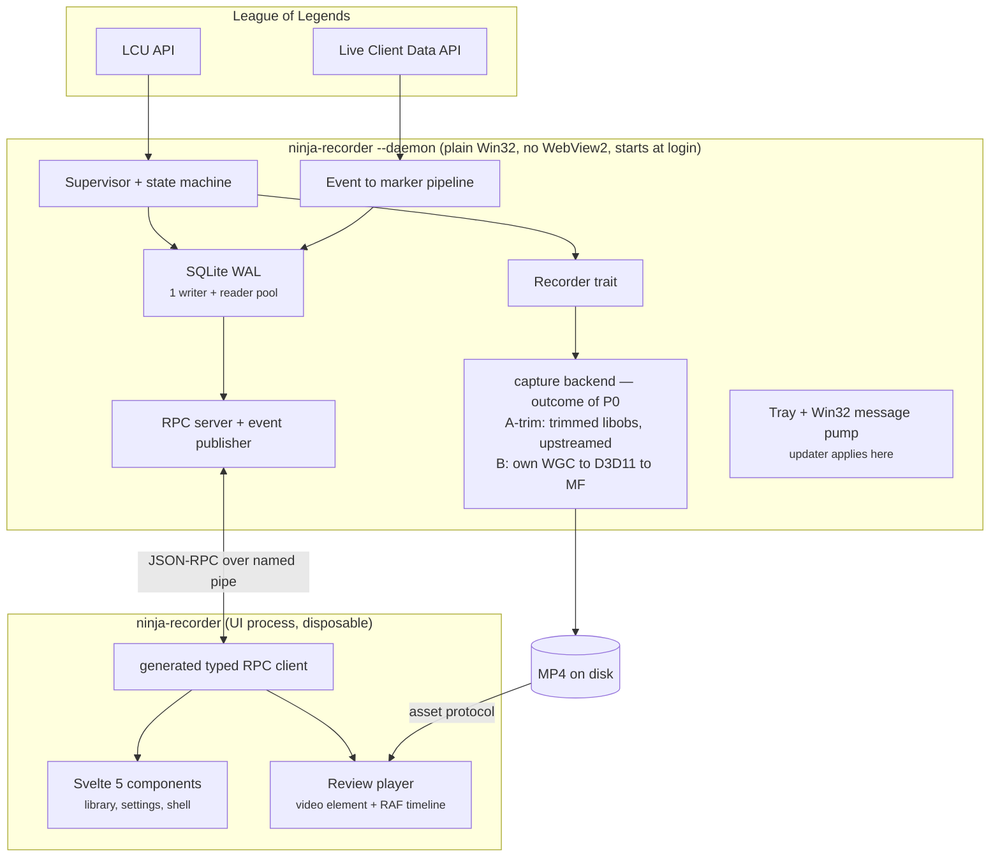
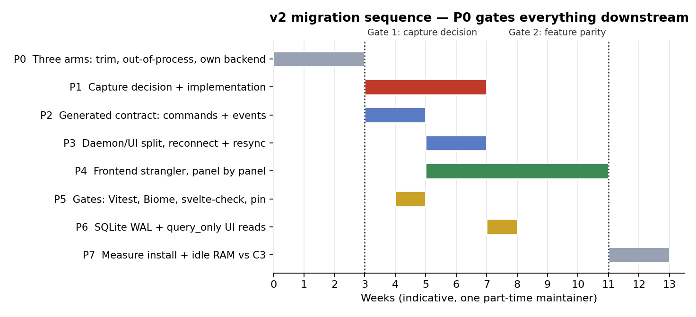

# ninja-recorder v2 — Architecture and Tech Stack Design Document

| | |
|---|---|
| **Project** | ninja-recorder (github.com/NinjaGoldfinch/ninja-recorder) |
| **Document** | v2 stack evaluation and target architecture |
| **Status** | Draft for decision |
| **Date** | 13 September 2026 |
| **Baseline analysed** | `main`, 325 commits, app version 0.8.0, declared target 1.1.0 |
| **Author** | NinjaGoldfinch |

---

## 1. Purpose, scope and non-goals

### 1.1 Purpose

v1 works, on real hardware, against Vanguard-protected games. This document exists to answer one question before any v2 code is written: **which parts of the stack should change, and which should be carried forward unchanged.**

A rewrite that re-picks every layer would mostly re-derive the decisions already recorded in `DEVELOPMENT.md`. The useful output of a v2 exercise is a short list of changes that are cheap now and expensive later, plus explicit permission to stop worrying about everything else.

### 1.2 Scope

- The application shell and runtime.
- The core implementation language.
- The capture backend and its licensing consequences.
- The frontend UI layer.
- The persistence layer.
- The IPC and command contract between core and UI.
- The process model.
- The test, lint and build toolchain.

### 1.3 Non-goals

- Changing the product. The feature set is settled and out of scope here.
- Relaxing the hard constraints in section 3. These are not trade-offs to re-weigh.
- Cross-platform support. Windows-only is a consequence of Windows.Graphics.Capture being the only injection-free way to record a Vanguard-protected game.
- YouTube upload and `.rofl` replay download, both designed and deliberately unbuilt.

---

## 2. Current architecture (v1)

### 2.1 System overview

One Tauri v2 process holds everything: the Rust core, an embedded libobs capture backend, a SQLite library, and a WebView2 frontend.



*Figure 1 — v1 component architecture.*

### 2.2 Recording lifecycle



*Figure 2 — recording lifecycle.*

### 2.3 Component inventory

Measured from the repository at the analysed commit.

| Layer | Location | Size | Quality gates |
|---|---|---|---|
| Rust core | `src-tauri/src/` | 24,822 LOC | 447 tests, clippy `-D warnings` |
| Frontend | `src/` | 12,797 LOC | none |
| Largest Rust module | `db/mod.rs` | 2,446 LOC | single `Mutex<Connection>` |
| Largest frontend module | `review.ts` | 1,547 LOC | ~30 mutable module bindings |
| Static markup | `index.html` | 623 lines | located by selector at boot |
| Stylesheet | `src/styles.css` | 2,013 lines | global, unscoped |
| Command surface | `core/dispatch.rs` | 53 commands | one round-trip test |
| Decision log | `DEVELOPMENT.md` | 137 KB | unusually complete |

### 2.4 Stack manifest as it stands

| Concern | Current choice | Version |
|---|---|---|
| Shell | Tauri v2 (WebView2) | 2.x |
| Core language | Rust 2021 | stable |
| Capture | forked `libobs-recorder` | git branch pin |
| Windows APIs | `windows-rs` | 0.62 |
| HTTP and WebSocket | `reqwest`, `tokio-tungstenite` | 0.12 / 0.24 |
| Async runtime | `tokio` | 1.x |
| Storage | `rusqlite` bundled, `rusqlite_migration` | 0.32 / 1.x |
| Frontend | vanilla TypeScript, no framework | TS 5.6, Vite 6 |
| Frontend deps | `@tauri-apps/api` only | 2.x |
| Packaging | NSIS via Tauri bundler, unsigned | CI-built only |
| Updates | `tauri-plugin-updater`, manual install | Windows only |
| Licence | GPL-2.0-only | inherited from libobs |

### 2.5 What v1 got right

These carry forward untouched.

**The `Recorder` trait boundary.** A stub backend for the dev loop and a real one for Windows is what makes most of the system testable off Windows. It is also the seam that makes a capture backend swap thinkable at all. Without it, section 4.3 would not be a live option.

**`core` never naming a Tauri type.** This is the precondition for the daemon, and it was enforced for a concrete reason: making Wry reachable from a module with tests drags the Win32 GUI stack into the test binary, which then dies at load. That is a stronger discipline than most projects manage.

**Files as source of truth, SQLite as an index.** Correct polarity. A corrupt database costs an index rebuild, not the recordings.

**H.264 and AAC in fragmented MP4.** This single codec decision is what makes the review player a `<video>` element instead of a decoding project. It cascades further than it looks.

**Fixtures and the dev portal.** Driving the state machine without League running is the difference between a seconds-long feedback loop and a game-long one.

**The decision log.** `DEVELOPMENT.md` records rejected alternatives with reasons. That is why this document is short: most of the analysis already exists.

### 2.6 Where v1 hurts

Five findings, ordered by the cost of leaving them alone.

**F1 — The capture backend is a private fork of a young single-maintainer crate.** `libobs-recorder` is pinned to a fork branch carrying two patches, the second of which changes encoder and source lifetimes inside libobs and has not been run on real Windows hardware. Every upstream bump is now a merge with real risk. libobs is also roughly 200 MB of the 248 MB install, and the sole reason the project is GPL-2.0.

**F2 — The frontend is imperative DOM at a scale where that stops working.** `review.ts` holds about thirty module-scope mutable bindings that mix DOM references with application state. `index.html` is 623 lines of hand-written markup located by selector at boot, with `dom.ts::el()` throwing on a miss because a typo is the expected failure mode. This is the layer that makes v2 feel necessary.

**F3 — The IPC layer gave up type checking that codegen would give back.** The `core::dispatch` macro table replaced the argument deserialisation that `#[tauri::command]` used to generate. A wrong argument name is now a runtime failure rather than a compile error, and nested `Option` fields are silently dropped on a case mismatch. A round-trip test stands in for the type system, and `src/dev/registry.ts` is a hand-maintained mirror.

**F4 — Quality gates are asymmetric.** 447 Rust tests and clippy at `-D warnings` on both feature sets, against 12,797 lines of TypeScript with no test runner, no linter and no formatter. CI runs `tsc` and stops. The timeline clustering, stem synchronisation and scrub logic are among the trickiest code in the product, and none of it is covered.

**F5 — SQLite is configured conservatively.** Only `foreign_keys` is set. No WAL, no `busy_timeout`. A single `Mutex<Connection>` serialises reads behind writes. Harmless at current row counts, free to fix, and it becomes load-bearing the moment a daemon and a UI process both want the database.



*Figure 3 — the gate asymmetry described in F4.*

---

## 3. Constraints carried forward

Inherited from `DEVELOPMENT.md` section 1 and not re-evaluated here. Any option that violates one is disqualified rather than scored.

| # | Constraint | Consequence |
|---|---|---|
| C1 | No injection, hooking or memory reading | WGC or display capture only |
| C2 | Official APIs only — LCU and Live Client Data | data sources are fixed |
| C3 | Lightweight, measured: 200 MB install, 100 MB idle RAM | disqualifies Electron |
| C4 | Windows-only is honest, not an omission | portability earns no credit |

The current 248 MB install already exceeds the C3 ceiling. That is a finding, not a footnote.

C3 says "measured", but only install size ever has been. Idle RAM has no recorded figure for v1 and no projection for the two-process model in section 4.7, where it plainly goes up. Both belong in P0 and P7, with the method fixed in Appendix A.

---

## 4. Alternatives analysis

Each subsection lists the options with a short verdict, then explains the reasoning in prose. "Keep" means carry forward unchanged; "Change" means v2 should differ.

### 4.1 Application shell and runtime

| Option | Key advantage | Limiting factor | Verdict |
|---|---|---|---|
| **Tauri v2 + WebView2** | ~10 MB shell, free H.264 playback | webview crash kills recording | **Keep** |
| Electron + obs-studio-node | most proven path in this niche | 400 MB+, fails C3 | Rejected |
| egui or iced | no webview dependency at all | must own video decode | Rejected |
| WinUI 3 or WPF | native playback and Win32 access | abandons the Rust core | Rejected |
| Qt 6 + C++ | direct libobs linkage, small | licensing friction, full rewrite | Rejected |
| Flutter desktop | one UI codebase, good animation | weak Windows video playback | Rejected |

**Why Tauri stays.** The webview is not overhead here, it is the video player. The `<video>` element gives H.264 decode, seeking and track switching for free, and that is what makes the review player tractable. Its one real weakness is crash coupling: a WebView2 crash, or a WebView2 Runtime auto-update, currently takes an in-progress recording with it. That is addressed by the process split in section 4.7 rather than by changing shell.

**Why the pure-Rust GUIs lose.** egui and iced would eliminate the webview dependency entirely, which is genuinely attractive. But the review player would then have to own H.264 decode, frame presentation, seeking and audio-track switching. That is a larger project than the recorder itself, and immediate-mode UI is also a poor fit for the text-heavy settings and library surfaces.

**Why the native-toolkit options lose.** WinUI 3 and Qt both solve presentation well and would give direct access to capture APIs. Neither justifies rewriting 24,822 lines of tested Rust for a presentation-layer benefit. Electron fails on measurement alone: 400 MB installed and roughly 300 MB resident, against a 200 MB ceiling.

### 4.2 Core implementation language

| Option | Key advantage | Limiting factor | Verdict |
|---|---|---|---|
| **Rust** | complete typed Win32/WinRT bindings | steeper FFI boundary | **Keep** |
| C++ | direct libobs use, best MF samples | manual lifetimes at the crash seam | Rejected |
| C# / .NET 8 | fastest path to native Windows UI | GC pauses in a capture loop | Rejected |
| Go | simple concurrency, fast builds | CGo tax at the hot boundary | Rejected |
| TypeScript / Node | one language across the app | needs Electron or a C++ addon | Rejected |

**Why Rust stays.** The decisive argument is `windows-rs`. The v2 capture option in section 4.3 depends on clean access to `ActivateAudioInterfaceAsync`, `IMMDeviceEnumerator`, D3D11 and Media Foundation, and Rust's bindings for all four are complete and typed. Memory safety also matters more than usual in a process that runs unattended for hours holding FFI handles into libobs.

**Why the alternatives lose.** C++ would remove the binding layer, since libobs is C, but manual lifetime management around encoder and capture handles is precisely where this class of application crashes. C# and Go both introduce a garbage collector into an encode pipeline. All three would rebuild the existing 447 tests and the `core` module discipline from nothing.

#### 4.2.1 Edition and toolchain policy

Keeping Rust is not the same as keeping the Rust configuration. Three separate questions sit behind "should we be on a newer Rust", and they have different answers.

| Question | Position today | v2 |
|---|---|---|
| Compiler version | CI installs `stable`, always newest | pin an exact version |
| Language edition | 2021 | **2024** |
| Minimum supported version | undeclared | not applicable |

**The compiler is already current, and that is the problem.** CI installs `stable`, so every build uses whatever shipped most recently. Rust releases every six weeks with no LTS branch, and clippy gains new lints on that same cadence. Combined with the existing `-D warnings` gate, a routine Rust release can fail the build with no commit behind it. Builds are also not reproducible: two CI runs a month apart compile with different compilers.

The fix is a `rust-toolchain.toml` in `src-tauri/` pinning an exact version with `rustfmt` and `clippy` as components, then bumping it deliberately in its own pull request where new lint failures are the expected content of the diff rather than a surprise blocking unrelated work.

**The edition should move to 2024.** It stabilised in Rust 1.85 and has had well over a year to settle. The change that earns its keep here is `unsafe_op_in_unsafe_fn` becoming warn-by-default. Under edition 2021 the body of an `unsafe fn` is implicitly one large unsafe block, so a function calling three FFI functions reads the same as one calling none. Edition 2024 makes each call site explicit, which is worth having across `recorder/libobs/`, `recorder/devices.rs` and the COM work in `windows-rs`.

Two costs to plan for. The `-D warnings` gate denies rustc lints as well as clippy's, so the first build after the bump fails on every implicit unsafe operation in the tree; that backlog is the work, and it is also the point. Separately, references to `static mut` become a hard error rather than a lint, which needs restructuring rather than annotating wherever it appears.

`cargo fix --edition`, run from `src-tauri/`, handles most of the mechanical part. Editions are per-crate, so the bump does not touch `libobs-recorder` or `windows-rs` — they continue to compile under whatever edition they declare.

**Minimum supported version does not apply.** MSRV is a constraint for library authors with downstream consumers. This project ships an installer, so the only Rust version that matters is the one CI pins.

### 4.3 Capture backend — the decision that gates everything else

This is the only layer where the recommendation is genuinely open. It should be resolved by measurement before any other v2 work starts — and by three parallel arms, not one. An earlier draft of this document framed the choice as "keep 200 MB" against "own everything", which is a false binary: the middle options are cheaper than either and were never priced.



*Figure 4 — capture backend decision tree.*

#### Option A — keep libobs, but stop owning a fork

Upstream the `window_capture` source swap and the multi-track audio patch, or maintain them as a published crate rather than a branch pin. Two refinements sit on top, and they compose rather than compete.

**A-trim: ship less of libobs.** The ~200 MB is a stock OBS payload — every plugin, the full ffmpeg codec set, and the browser source with its embedded Chromium, which alone is a large fraction of the total. A recorder needs `win-capture`, `win-wasapi`, `obs-ffmpeg`, the hardware encoder plugins and a minimal ffmpeg build. Plausibly well under 100 MB, which would put Option A inside the C3 ceiling for roughly a day of build-script work in the existing staging step.

This is the single highest-leverage measurement in the document and it requires no code. Two caveats: there is a floor, since libobs needs its `data/` directory, effect files and locale, and plugins load dynamically, so each cut has to be verified against a real recording rather than assumed from a filename. And trimming changes nothing about licensing — GPL-2.0 applies to a 60 MB libobs exactly as it does to a 200 MB one.

**A-split: confine libobs to the daemon.** Section 4.7 puts the recorder in its own process regardless. Doing so means libobs is linked into the daemon only, which is where the crash-isolation benefit comes from and also where a licensing argument becomes available. See "the licensing question" below.

| Advantages | Disadvantages |
|---|---|
| zero implementation risk | ~200 MB until A-trim is measured |
| records real games today | GPL-2.0 unless the A-split argument holds |
| encoder and muxing already solved | upstream fixes arrive on its schedule |
| A-trim may meet C3 for a day of work | fork risk returns if upstream refuses |
| cheapest by a wide margin | still a young single-maintainer dependency |

#### Option B — own the backend: WGC to D3D11 to Media Foundation SinkWriter

This was considered and rejected in v1 as "legitimately clean but we'd own A/V sync". That was the right call then. Three things have changed since.

First, **the requirement set is now known.** Not "whatever OBS does", but a specific list: WGC window capture, one hardware encoder, H.264 and AAC, fragmented MP4, N audio tracks including per-process loopback. That is a far smaller target than the one being estimated against in v1.

Second, **the footprint delta is now measured rather than guessed.** Roughly 25 MB against 248 MB, against a self-imposed 200 MB ceiling the project currently exceeds.

Third, **the licence is cheap to change now and expensive later.** GPL-2.0 is inherited purely from libobs. Removing it before a v2 ships preserves every future option; removing it afterwards means re-licensing a codebase that may by then have outside contributors.

| Advantages | Disadvantages |
|---|---|
| ~25 MB installed, a tenfold cut | you own A/V sync and frame pacing |
| comfortably inside the C3 ceiling | ~1,000–1,500 lines of hard code |
| removes the GPL obligation entirely | encoder selection rebuilt for three vendors |
| no fork, no rebase debt | per-app audio must be rebuilt |
| smaller surface to audit and link | regressions hit unrepeatable recordings |
| faster cold start, no libobs init | no upstream to inherit fixes from |

**The one thing that decides this.** `wasapi_process_output_capture` is what puts game audio on its own track, and every audio preset in the product depends on it. The underlying Windows API is public and documented — `ActivateAudioInterfaceAsync` with `AUDIOCLIENT_ACTIVATION_PARAMS` set to process loopback, available since Windows 10 2004 — so this is not black magic. But it is finicky, and it is the piece most likely to sink Option B. Spike it first, in isolation, before committing to anything else in v2.

**What "you own A/V sync" actually means.** The 1,000–1,500 line estimate is the muxing and plumbing. It does not cover the four items below, and any honest reading of Option B has to price them. This is why the Option B arm of P0 is budgeted at two weeks rather than two days.

| Hidden cost | What it actually involves |
|---|---|
| Multi-clock drift | each WASAPI endpoint runs on its own hardware clock |
| | mic, game loopback and system drift against each other |
| | resampling them onto one timeline is the real work |
| Colour conversion | WGC delivers BGRA from a frame pool |
| | needs a D3D11 shader pass to NV12 for the encoder |
| Frame pacing | the pool fires on content change, not on a clock |
| | CFR output needs a cadence thread that duplicates frames |
| Hybrid GPUs | capture and encode adapters may differ on laptops |
| | that forces a cross-adapter copy per frame |
| Remux | v1 remuxes with ffmpeg after recording |
| | without it, a source-reader pass or a Rust MP4 remuxer |
| Encoder MFTs | MF exposes less rate control than the vendor SDKs |
| | B-frames, lookahead and CQP behaviour vary by vendor |
| | quality per bitrate may regress against libobs |

**A variant worth naming: B2, direct vendor SDKs.** If the MF encoder path proves to be the weak link on quality, the answer is not to retreat to libobs but to keep WGC and D3D11 for capture while calling NVENC, AMF and oneVPL directly, which is what OBS itself does. More work than SinkWriter, and it removes the rate-control concern entirely. Treat it as the fallback within Option B rather than a separate option.

**Vendor detection still works.** The "no silent x264 fallback" rule survives: enumerate with `MFT_ENUM_FLAG_HARDWARE` and read the vendor-ID attribute to identify NVENC, AMF and QSV, then refuse rather than degrade. That part is not at risk.

#### The licensing question, stated as unresolved

Once libobs lives in a separate daemon process communicating over JSON-RPC, there is a mainstream argument that the daemon and the UI are arms-length separate programs, so only the daemon inherits GPL-2.0 and the rest of the codebase could be relicensed.

**This document does not score that argument, and the matrix in section 5 does not credit it.** The FSF's test is not process separation but how intimate the communication is, and a daemon and a UI built from one repository, shipped as one binary, speaking a purpose-built contract over a private protocol sit on the harder side of that line. It is not the plugin-over-a-pipe case where the argument is strongest.

Licensing freedom is in the matrix as *optionality*. Optionality that rests on a contested legal reading is exposure, not optionality. Nobody involved in writing this is a lawyer. If the licence ever becomes commercially load-bearing, that is the moment to ask one — not a reason to score Option A higher now.

#### Options already rejected in v1 and still rejected

| Option | Why it stays rejected |
|---|---|
| obs-websocket against installed OBS | user must install and configure OBS |
| FFmpeg CLI with `ddagrab` | no native WASAPI loopback on Windows |
| OBS-style Game Capture (injection) | violates C1, not a trade-off |
| Xbox Game Bar / AppRecording | no multi-track audio or encoder control |



*Figure 5 — installed footprint by shell and capture backend, against the 200 MB ceiling.*

**Verdict: Change, conditionally.** Carry Option A-trim forward as the safe default, and run all three P0 arms in parallel. Do not carry Option C, the private fork, into v2 under any outcome. Note that A-trim and A-split compose: a trimmed libobs confined to the daemon is one configuration, not two competing ones.

### 4.4 Frontend UI layer

| Option | Cost | Key advantage | Verdict |
|---|---|---|---|
| **Vanilla TS, imperative DOM** | 0 KB | no dependencies at all | **Change** |
| **Svelte 5 (runes)** | ~10–15 KB gz | compiles to direct DOM ops | **Recommended** |
| SolidJS | ~7–10 KB gz | finest-grained reactivity | Strong alternative |
| React 19 | ~45 KB gz | largest ecosystem | Not recommended |
| Vue 3 | ~35 KB gz | excellent developer experience | Neutral |
| Lit | ~6 KB gz | standards-based, no build step | Rejected |

**Why vanilla has to go.** State and DOM references are the same variables. Markup lives in a 623-line HTML file located by selector. Every list render is manual, there are no component boundaries, and `escapeHtml` and `escapeAttr` are hand-rolled XSS defence that a framework makes unnecessary.

**Why the "lightweight" justification does not survive.** It was measured against Electron, not against a compiled framework. Against a 248 MB installer, ten kilobytes of gzipped runtime is rounding error. The constraint that ruled out Electron does not rule out Svelte.

**Why Svelte 5 over the others.** It compiles to direct DOM operations with no virtual DOM, its fine-grained reactivity suits a per-frame playhead, and scoped component styles would dissolve the 2,013-line global stylesheet. The learning delta from imperative code is also the smallest of the options. The costs are real but small: runes are recent, and some ecosystem documentation still assumes Svelte 4.

**SolidJS is an acceptable substitute** if JSX is preferred. It has the finest-grained reactivity of the set, at the price of a smaller community and reactivity rules that trip newcomers, since destructuring breaks tracking. **React is the wrong default here.** Virtual DOM reconciliation fights a 60 fps scrubber, and you would opt out with refs for the player anyway.

**Two qualifications.** The review player stays imperative: the `<video>` element, the RAF-driven playhead, the scrub handling and the stem-audio synchronisation should live in one component that owns real DOM nodes directly. A framework does not help there and can hurt. And the H.264, AAC and `<video>` decisions stay exactly as they are.

### 4.5 Persistence

| Option | Key advantage | Limiting factor | Verdict |
|---|---|---|---|
| **`rusqlite` + migrations** | direct, synchronous, no runtime | one mutex serialises reads | **Keep, tuned** |
| `sqlx` | compile-time checked queries | async SQLite is a thread pool | Rejected |
| `sea-orm` / `diesel` | type-safe query building | overhead for a small schema | Rejected |
| `redb` / `sled` | pure Rust, no C dependency | loses SQL entirely | Rejected |
| DuckDB | strong analytics over samples | wrong tool, far larger | Rejected |
| JSON sidecar files | zero dependency, inspectable | full scans, no transactions | Rejected |

**Why rusqlite stays.** Bundled SQLite removes a system dependency, migrations are explicit and versioned through `PRAGMA user_version`, and SQL is what the retention policy, the dev portal's raw-SQL panel and the library filters all use. Dropping to a key-value store would be a downgrade, and an ORM buys little for a schema this small.

**What changes in v2.** Enable WAL, set a `busy_timeout`, and split into one writer connection plus a small reader pool. The third item becomes necessary rather than optional once the daemon and the UI are separate processes.

**Ownership across the process split, decided.** The daemon owns the schema, runs the migrations and performs every write. The UI opens its own connection for the library view and sets `PRAGMA query_only = ON`, which enforces read-only discipline at the connection level. Set `synchronous = NORMAL` alongside WAL: with WAL that is durable against process crashes, losing only the last transactions on an OS crash, which is the right trade for an index whose source of truth is the MP4 files.

A note on a tempting mistake: do not try to open the UI's connection read-only at the file level. WAL needs a shared-memory index, and creating it requires write access, so a genuinely read-only connection only works when some other connection already maintains the shm. Depending on that ordering is fragile. `query_only` achieves the same discipline without it.

### 4.6 IPC and the command contract



*Figure 6 — one declaration, both sides generated.*

| Option | Key advantage | Limiting factor | Verdict |
|---|---|---|---|
| Plain `#[tauri::command]` | generated deserialisation | cannot be called from Rust | Rejected |
| **Hand-rolled dispatch table** | enables a future daemon | argument checking is manual | **Change** |
| `tauri-specta` | generates the TS client | still Tauri-shaped | Near term |
| `ts-rs` | minimal, types only | client still hand-written | Acceptable |
| **JSON-RPC over named pipe** | one protocol for every caller | you own framing and reconnect | **Target state** |
| `tarpc` | typed Rust services end to end | Rust-to-Rust only | Partial fit |

**Why the current table has to change.** Tauri v2 cannot invoke a registered command by name from Rust, which is exactly why v1 moved away from `#[tauri::command]`. But the replacement gave up the generated argument deserialisation, including camelCase mapping. A wrong name or type is now a runtime failure, nested `Option` fields drop silently on a case mismatch, and `src/dev/registry.ts` is a hand-maintained mirror of the Rust table.

**The contract runs in two directions, and only one of them is a command.** Recording state, timeline markers as they are produced, and LCU phase changes all originate in the daemon and push to the UI. A request/response table does not describe them. JSON-RPC notifications carry them on the wire, but "generate both sides from one declaration" has to mean commands *and* an event enum, or the event half goes back to being hand-written in exactly the way the command half no longer is.

Three things follow. The declaration needs an `Event` enum alongside the command signatures, generating a discriminated union on the TypeScript side. The contract needs a subscription model, so the UI states what it wants rather than receiving everything. And the UI needs a full state resync on connect, because a UI that attaches mid-recording has missed every event that came before it — which is the normal case, not an edge case, once the UI is disposable.

**Verdict: Change.** Declare commands and events once in Rust, generate the TypeScript client from both, and make the transport pluggable so the same declaration serves a Tauri `invoke` today and a named-pipe JSON-RPC daemon tomorrow. The existing dispatch macro is roughly 80 percent of the command half and none of the event half. Finishing it recovers the type safety that was traded away, and the round-trip drift test becomes unnecessary rather than load-bearing.

### 4.7 Process model

| Option | Key advantage | Limiting factor | Verdict |
|---|---|---|---|
| Single process | simplest, one lifecycle | webview crash kills recording | Change |
| **Daemon + UI, one binary** | crash isolation for recordings | needs an IPC transport | **Change to this** |
| Windows Service | starts before login | session 0 isolation breaks WGC | Rejected |
| Two separate binaries | cleaner separation | two update paths, no benefit | Rejected |

**Why the split is worth it, stated honestly.** It does not save memory. Two processes cost more RAM while the UI is open, not less, and a hidden window keeps WebView2 fully resident anyway. What it buys is crash isolation: the recorder survives anything the webview does, including a WebView2 Runtime auto-update mid-game. It also lets the UI be genuinely absent rather than merely invisible.

**Make it the starting point, not a retrofit.** The `core` module already satisfies the precondition, and section 4.6's generated contract supplies the transport.

**The shape of each process, stated rather than assumed.** The daemon is a plain Win32 process: no WebView2, no Wry, no window. It owns the supervisor, the database, the `Recorder`, the capture backend and the tray icon — and because it owns the tray, it needs its own Win32 message pump, which is the concrete reason it cannot be a bare async runtime with no event loop. The UI is the Tauri process and owns only presentation plus the shell integrations that must run in the foreground session, which is where `open_recordings_folder` already lives.

Keeping WebView2 out of the daemon is also what keeps C3's idle-RAM ceiling meaningful. The resting state of this product is the daemon alone with no UI running, and that is the number the target should be measured against.

**Four consequences to design for, not discover.**

*Who starts the daemon.* "The UI starts the daemon if absent" answers the wrong question. The product records unattended, so the daemon must start at login on its own. The existing `tauri-plugin-autostart` already writes the Run key; in v2 it points at `--daemon` rather than at the UI. The UI starting the daemon is the recovery path, not the primary one.

*Who applies updates.* The updater must run in the daemon. A UI process that updated itself would replace the binary out from under a recording in progress, and v1's rule that updates never install during a recording only holds if the process that knows about the recording is the one doing the installing.

*Reconnection.* The UI must survive the daemon restarting under it, and vice versa. This is section 4.6's resync requirement, and it is the exit criterion for P3.

*Version skew.* One binary in two modes rules it out by construction. This is the main reason not to split into two binaries.

### 4.8 Test, lint and build toolchain

| Concern | Current | v2 | Change? |
|---|---|---|---|
| Rust tests | 447, gated in CI | unchanged | Keep |
| Rust lint | clippy `-D warnings` | unchanged | Keep |
| Rust toolchain | floating `stable` | pinned in `rust-toolchain.toml` | **Change** |
| Rust edition | 2021 | 2024 | **Change** |
| Frontend tests | none | Vitest + mocked RPC | **Change** |
| Frontend lint | none | Biome | **Change** |
| Type check | `tsc` only | plus `svelte-check` | **Change** |
| Component tests | none | Vitest browser mode | **Change** |
| Dependency audit | none | `cargo deny` (licences + advisories) | **Change** |
| Frontend CI gate | `tsc` only | plus `biome ci`, `vitest run` | **Change** |
| Build | Vite 6, CI-only installers | unchanged | Keep |

**Why pinning belongs in this section.** A pinned toolchain is the same kind of change as the frontend gates: it makes CI fail for reasons you chose. Today a new clippy lint can break `main` with no commit behind it, which is the opposite property from the one a quality gate is supposed to have. Pinning also makes builds reproducible, which matters for a project whose installers only ever come from CI. Section 4.2.1 has the detail.

**Two additions that are easy to forget.** `tsc` does not type-check `.svelte` files, so a Svelte migration silently narrows the existing type gate unless `svelte-check` runs alongside it. And `cargo deny` belongs here rather than in a security section: it checks licences as well as advisories, which makes it the mechanism that keeps the section 4.3 licensing position honest as dependencies change underneath it.

**Why this is the cheapest item on the list.** The timeline clustering, marker grouping, stem synchronisation and format helpers are pure functions and testable today, with no refactoring required first. Biome is a single binary covering both lint and format, where ESLint plus Prettier is three dependencies and two configs. The deliberate absence of `--all-targets` from the clippy invocation should stay documented, since the dead-code interaction it avoids is a real trap.

---

## 5. Decision matrix

Weighted against the constraints in section 3 plus maintainability. Scores run 1 (poor) to 5 (excellent).

| Criterion | Weight | v1 as-is | v2 + libobs | v2 + trimmed | v2 + own |
|---|---|---|---|---|---|
| Meets install ceiling (C3) | 20% | 2 | 2 | 4 | 5 |
| Capture reliability today | 25% | 4 | 5 | 5 | 2 |
| Frontend maintainability | 20% | 2 | 4 | 4 | 4 |
| Contract safety | 10% | 2 | 4 | 4 | 4 |
| Licensing freedom | 10% | 1 | 1 | 1 | 5 |
| Implementation cost | 15% | 5 | 4 | 4 | 1 |
| **Weighted total** | | **2.80** | **3.50** | **3.90** | **3.45** |

Three notes on how to read this.

**A-trim leads, and it leads on a number nobody has measured.** Its 4 on install size is an estimate of what a trimmed bundle weighs, and the whole column rests on it. That is the argument for measuring it in P0 rather than reasoning about it here — it is the cheapest arm and currently the highest-scoring option.

**Licensing freedom stays at 1 for every libobs column**, including A-split, for the reasons in section 4.3. Crediting the arms-length argument would move A-trim to roughly 4.3 and make it look decisive. It is not this document's call to make.

**The own-backend column remains within noise of plain libobs**, and its scores now reflect the hidden costs in section 4.3, not just the line estimate. Its case is the licence and the footprint, and A-trim takes most of the footprint argument away from it.

---

## 6. Recommended v2 architecture



*Figure 7 — recommended v2 architecture. The capture backend row shows the two live outcomes of P0; A-split is the arrangement the diagram already assumes.*

### 6.1 The v2 stack, stated plainly

| Layer | v1 | v2 | Change? |
|---|---|---|---|
| Shell | Tauri v2 | Tauri v2 | Keep |
| Core language | Rust | Rust | Keep |
| Edition | 2021 | 2024 | **Change** |
| Toolchain | floating `stable` | pinned exact version | **Change** |
| Capture | forked libobs | trimmed, split or owned | **By P0** |
| Windows APIs | `windows-rs` | `windows-rs` | Keep |
| Storage | rusqlite, one mutex | rusqlite, WAL, pool | Tune |
| IPC | hand-rolled table | generated both sides | **Change** |
| Transport | Tauri invoke only | invoke plus JSON-RPC | **Change** |
| Event flow | Tauri events, ad hoc | generated event enum | **Change** |
| DB ownership | one process | daemon writes, UI `query_only` | **Change** |
| Tray and autostart | UI process | daemon, Win32 pump | **Change** |
| Updates applied by | UI process | daemon | **Change** |
| Process model | single process | daemon + disposable UI | **Change** |
| Frontend | vanilla TS | Svelte 5 | **Change** |
| Styling | global CSS, 2,013 lines | scoped styles + tokens | **Change** |
| Frontend tests | none | Vitest | **Change** |
| Frontend lint | none | Biome, gated in CI | **Change** |
| Codecs | H.264, AAC, fMP4 | unchanged | Keep |
| Packaging | NSIS, CI-only | unchanged | Keep |
| Licence | GPL-2.0-only | follows the capture choice | Conditional |

---

## 7. Migration plan



*Figure 8 — indicative sequencing for one part-time maintainer.*

| Phase | Work | Exit criterion |
|---|---|---|
| **P0a** | Trim and measure the libobs bundle | a recorded game from a bundle under 200 MB |
| **P0b** | libobs in a daemon, kill the UI | recording survives, idle RAM recorded |
| **P0c** | Loopback (2 d), then SinkWriter (2 wk) | 10-min sample, isolated audio, no drift |
| **P1** | Capture decision, then build | records a full game on real hardware |
| **P2** | Generated contract: commands + events | the drift test is deleted as unnecessary |
| **P3** | Daemon and UI split | UI killed mid-recording, reconnects, resyncs |
| **P4** | Frontend strangler, panel by panel | parity against dev portal fixtures |
| **P5** | Gates: Vitest, Biome, svelte-check, pin | CI fails only for chosen reasons |
| **P6** | SQLite WAL, daemon writes, UI reads | concurrent access with no `SQLITE_BUSY` |
| **P7** | Measure install and idle RAM, ship | both figures recorded against C3 |

**Sequencing rules.**

*P0 has three arms and they run in parallel.* P0a is a day of build-script work and currently the highest-scoring outcome in the matrix. P0c is two weeks and the only one that needs real implementation effort. Running them concurrently means the cheap answer is not blocked behind the expensive one.

*P2, P5 and P6 do not depend on the capture decision* and should proceed alongside P0 and P1. Only P1 is gated.

*Do not start P4 before P2.* Rewriting the frontend against a hand-maintained contract means doing the migration twice.

*P4 is a strangler, not a big bang.* Svelte's `mount()` attaches a component to an existing DOM node, so panels inside the current `index.html` can be replaced one at a time while the rest stays vanilla. Library first, settings next, review player last. This matters for sequencing as well as risk: P3 lands the new transport while the frontend is still partly vanilla, and without the strangler that would mean porting vanilla code to the new transport and then deleting it. It also directly de-risks "rewrite loses player behaviour", since the player moves last, alone, against a UI that is otherwise already migrated.

---

## 8. Risk register

| Risk | Likelihood | Impact | Mitigation |
|---|---|---|---|
| P0c loopback arm fails | Medium | Medium | two days, throwaway; A-trim is the fallback |
| P0c SinkWriter arm fails | Medium | Medium | two weeks, throwaway; A-trim is the fallback |
| Trimmed libobs misses 200 MB | Medium | Medium | measure in P0a before anything depends on it |
| Own backend drifts A/V | Medium | High | keep libobs selectable for one release cycle |
| Rewrite loses player behaviour | Medium | Medium | port the player last, fixtures as regression |
| Scope creep in v2 | **High** | High | section 1.3 non-goals are binding |
| "Daemon not running" class | Medium | Medium | UI auto-starts it; one binary, no skew |
| Riot changes the APIs | Low | High | thin client layer plus fixtures localise it |
| Svelte 5 churn | Low | Low | surface is ordinary CRUD, not exotic |
| New clippy lint breaks `main` | **High** | Low | pin the toolchain; bump in its own PR |
| Edition bump surfaces unsafe backlog | High | Low | expected, not a regression; `cargo fix` first |
| MF encoders regress quality | Medium | Medium | B2 variant: call vendor SDKs directly |
| Arms-length licence argument fails | Medium | Low | not credited in the matrix; ask a lawyer |
| Multi-clock audio drift under B | **High** | High | it is the bulk of P0c; measure, do not assume |
| Licence questions on old code | Low | Medium | confirm no GPL-derived code first |

---

## 9. Open questions before P1

1. Which process should process loopback target? Vanguard is unlikely to interfere — WASAPI is an audio API, not a memory-access path — but the real problem is the process tree. Audio comes from `League of Legends.exe`, not from the client that the LCU integration tracks, so this needs `PROCESS_LOOPBACK_MODE_INCLUDE_TARGET_PROCESS_TREE` and a decision about which PID is the root. Getting the root wrong produces silence, not an error.
2. Does MF SinkWriter's fragmented MP4 output stay playable when the process is killed mid-recording? The crash-safety rule depends on this, and libobs currently satisfies it.
3. Can hardware encoder selection — NVENC, then AMF, then QSV, then refuse — be implemented over MF's encoder enumeration with the same no-silent-fallback guarantee?
4. Is the `libobs-recorder` maintainer receptive to upstreaming the `window_capture` swap? A yes makes Option A meaningfully stronger.
5. How much does a trimmed libobs bundle actually weigh once `data/`, the effect files and the locale floor are accounted for? P0a answers this, and the matrix currently leans on the estimate.
6. Does the arms-length licensing argument in section 4.3 hold for a daemon and UI shipped from one repository as one binary? Unresolved, uncredited, and a question for a lawyer rather than for this document.
7. Do the MF encoder MFTs give acceptable quality per bitrate against libobs's direct NVENC path, or does Option B need the B2 variant from the start?

*Previously open, now answered:* database ownership across the process split is settled in section 4.5 — the daemon owns the schema and all writes, the UI reads with `query_only = ON`.

---

## 10. Conclusion — the optimal implementation

**The stack is not the problem, and a v2 framed as "re-pick the stack" would waste the effort.** Tauri, Rust, SQLite, files-as-truth, H.264 and AAC, and the `Recorder` trait are all correct, and the reasoning behind them is already written down better than most commercial projects manage.

What makes v2 worth doing is four specific changes, three of them unambiguous.

**One: rewrite the frontend in Svelte 5, keeping the player as an imperative island.** This is where the maintenance pain actually lives. The justification for vanilla TypeScript was measured against Electron, not against a compiled framework, and it does not survive contact with a 248 MB installer.

**Two: declare the command surface once and generate both sides.** The dispatch table is most of an RPC layer already. Finishing it recovers the compile-time checking that was traded away and makes the daemon's transport free rather than a second contract to maintain.

**Three: add Vitest and Biome to CI, and pin the Rust toolchain.** Cheapest item on the list, largest immediate effect on "better maintained". The frontend gates close the gap between 447 Rust tests and zero frontend tests. The toolchain pin closes the opposite gap: a build that can fail for reasons nobody chose. Move to edition 2024 in the same phase, for the explicit unsafe blocks it forces across the FFI boundary.

**Four: resolve the capture backend by measurement, not by argument — and measure three things, not one.** Stop carrying a private fork under every outcome. The cheapest arm is also currently the strongest: a trimmed libobs bundle may meet the 200 MB ceiling for about a day of build-script work, and if it does, most of the case for owning the backend evaporates. Confining libobs to the daemon buys crash isolation on top of that. Owning the backend outright remains worth spiking, because it takes the install to roughly 25 MB and removes the GPL obligation, but its cost is multi-clock audio drift and frame pacing rather than the line count, and that is a two-week question. If it fails, upstream the patch and keep trimmed libobs with no shame attached — it records real games today, which is more than any alternative can currently say.

**Make the daemon the starting point rather than a retrofit.** The `core` module already earned that option. v2 is the moment to spend it, and the generated contract from change two is what makes it cheap.

**Sequence matters more than scope.** P0 first, because the capture answer changes the licence, the install size and about a third of the Rust tree, and nothing else in the plan does. Its three arms run concurrently so the cheap answer is not queued behind the expensive one. Everything else can proceed in parallel and should. The failure mode to guard against is not picking the wrong stack. It is a v2 that accumulates features while the four changes above stay unfinished.

**A closing note on what this revision did to the document.** Pricing the middle options, the bidirectional contract, the daemon's actual shape and Option B's hidden costs has made this document less decisive than its first draft, not more. The capture section now has three live arms where it had two, and the strongest one rests on a number nobody has measured. That is the correct direction. A design document that reads as decisive because it did not look at the cheap options is not a useful artifact — it is a commitment device for a decision that was already made.

---

## Appendix A — measurement method

All figures in section 2 were taken from a shallow clone of `main` at the analysed commit.

```bash
git clone --depth 50 https://github.com/NinjaGoldfinch/ninja-recorder.git
cd ninja-recorder

# Rust and frontend line counts
find src-tauri/src -name '*.rs' | xargs wc -l | sort -rn
find src           -type f      | xargs wc -l | sort -rn

# Test and gate inventory
grep -rn '#\[test\]' src-tauri/src | wc -l
grep -rn '#\[tauri::command\]' src-tauri/src | wc -l

# SQLite configuration in force
grep -rn 'PRAGMA' src-tauri/src/db/mod.rs
```

**Memory measurement, defined.** C3 sets a 100 MB idle-RAM target but no method, which makes the target unfalsifiable. Fix it as follows and record both numbers in `docs/windows-verification.md`:

- **Private Bytes** (private committed memory) is the headline figure, because it excludes shared pages and is the honest measure of what the process costs the machine.
- **Working Set** is recorded alongside it for comparison with Task Manager, which is what a user would look at.
- Measure the **daemon alone, with no UI running and no recording in progress**. That is the product's resting state and the only state the ceiling should describe.
- Record the two-process total separately, as a second figure, so the cost of having the UI open is visible rather than hidden.

Baseline v1 in P0 before any of this changes, so the v2 figures have something to be compared against.

Install-size figures are the project's own. `src-tauri/Cargo.toml` records roughly 200 MB of a 248 MB install as libobs and ffmpeg, and `DEVELOPMENT.md` carries the 25 MB estimate for a from-scratch backend and the 400 MB figure for Electron with obs-studio-node.

## Appendix B — glossary

| Term | Meaning |
|---|---|
| **WGC** | Windows.Graphics.Capture, the injection-free OS capture API |
| **LCU** | League Client Update API, local HTTP and WebSocket |
| **Live Client Data** | in-game HTTP API on port 2999, polled at 1 Hz |
| **MF SinkWriter** | Media Foundation's encoding and muxing interface |
| **Process loopback** | per-application audio capture, Windows 10 2004+ |
| **Fragmented MP4** | MP4 written in self-contained fragments, crash-safe |
| **Imperative island** | a component that owns real DOM nodes directly |
| **Vanguard** | Riot's kernel anti-cheat, the reason injection is banned |

## Appendix C — v1 rejections revisited

| v1 decision | Still valid? |
|---|---|
| Electron + obs-studio-node rejected | **Yes** — unchanged |
| obs-websocket rejected | **Yes** — unchanged |
| FFmpeg `ddagrab` rejected | **Yes** — unchanged |
| From-scratch WGC/D3D11/MF rejected | **Re-open** — requirements now known |
| Vanilla frontend chosen | **Re-open** — compared against the wrong option |
| `#[tauri::command]` abandoned | **Yes** — but generate the replacement |
| MKV rejected in favour of MP4 | **Yes** — unchanged and load-bearing |
| `tracing` rejected for a custom logger | **Yes** — out of scope for v2 |
