# ninja-recorder v2 — Implementation and Design Document

| | |
|---|---|
| **Project** | ninja-recorder (github.com/NinjaGoldfinch/ninja-recorder) |
| **Document** | v2 implementation plan: what to build, in what order, and how each piece is shaped |
| **Companion** | *ninja-recorder v2 — Architecture and Tech Stack Design Document* (13 Sep 2026), which decides *what changes*; this document decides *how* |
| **Baseline** | `main` at `32dcd41`, app version 0.8.0 (declared 1.1.0), 24,822 lines of Rust / 447 tests, 12,797 lines of TypeScript / 0 tests |
| **Date** | 13 September 2026 |
| **Status** | Draft for review — rev 2 (Option B is the target; licence exit is a goal) |

---

## Contents

1. Summary
2. Starting point — what v1 already provides
3. Target architecture
4. Detailed designs
   - 4.1 Contract and code generation
   - 4.2 Transport: JSON-RPC over a named pipe
   - 4.3 The daemon process
   - 4.4 Persistence
   - 4.5 Capture backend — the P0 arms
   - 4.6 Frontend
   - 4.7 Toolchain and quality gates
5. Workstreams and task breakdown
6. Testing and verification
7. Risks specific to implementation
8. Definition of done for v2.0.0
9. Open questions and inputs needed

Appendix A — command inventory · Appendix B — draft event enum · Appendix C — libobs trim candidates · Appendix D — file map

---

## 1. Summary

The design document settles the stack: keep Tauri, Rust, SQLite, files-as-truth, H.264/AAC in fragmented MP4, and the `Recorder` trait; change the frontend, the IPC contract, the process model, the quality gates and the capture backend. This document turns those decisions into work.

**One decision the design document left open is closed here.** The maintainer intends to leave GPL-2.0 so that a closed-source or source-available distribution remains possible later. Every libobs configuration keeps the shipped binary GPL, so the own-backend path (Option B: WGC → D3D11 → Media Foundation) is the **target**, not a candidate. Trimmed libobs (A-trim) is retained only as the fallback if the P0c spike fails its go/no-go gates, and as a selectable second backend for exactly one release while Option B proves itself on real hardware. The licence changes at v2.1, when libobs is deleted — not before.

**v2 is eight workstreams**, three of which can start on day one with no dependency on anything else:

| WS | What | Gated by | Rough effort |
|---|---|---|---|
| WS0 | Baseline measurement (install size, idle RAM by Private Bytes) | — | 1 week, part-time |
| WS1 | Capture backend: P0c go/no-go spike, then build Option B; A-trim as fallback and one-release safety net | — (spike); gate (build) | 3 weeks spike + 4 weeks build |
| WS2 | Generated contract: commands *and* events declared once in Rust, TypeScript client generated | — | 2–3 weeks |
| WS3 | Daemon / UI split over a named-pipe JSON-RPC transport | WS2, WS6 | 3 weeks |
| WS4 | Svelte 5 strangler migration, player last as an imperative island | WS2 | 5–6 weeks |
| WS5 | Toolchain pin, edition 2024, Biome, Vitest, svelte-check, cargo-deny in CI | — | 2 weeks |
| WS6 | SQLite WAL, busy_timeout, writer + reader pool, `query_only` UI connection | — | 1 week |
| WS7 | Measure against C3 and ship v2.0.0 (Option B default, libobs selectable, still GPL-2.0) | everything | 1 week |
| WS8 | Remove libobs, audit derived code and contributors, relicense, ship v2.1.0 | one release of WS7 in the field | 1–2 weeks |
| WS9 | VOD review and note-taking: review form, objectives, takeaways, blocks, spreadsheet import. Additive, see [ADR 0004](../decisions/0004-add-ws9-vod-review.md) and [WS9](../workstreams/ws9.md) | P0: schema only. P1+: WS2, WS3, WS4, WS6 | Not estimated |

Total is on the order of **five months of part-time work to v2.0.0**, plus a short v2.1.0 that removes libobs and relicenses. The P0c gate (~week 4) is the only hard fork: if the process-loopback stage fails, per-application game audio is not achievable without libobs, and the licence goal has to be weighed against that product loss before continuing. Everything downstream is sequenced so that the answer changes *which backend is linked into the daemon* and nothing else.

Three things in the repository make this cheaper than a plan written from the design document alone would suggest, and they are worth stating up front:

- **`launch.rs` already parses `--daemon`** and refuses it with "not built yet". The launch mode, the `--hidden` flag, the autostart wiring and the tray all exist; WS3 fills in the process rather than inventing it.
- **libobs already runs out of process.** The fork's `extprocess_recorder.exe` is a separate worker driven over IPC from `LibObsRecorder`. "Confine libobs to the daemon" (A-split) is therefore about which process *owns* that worker, not about pushing FFI across a process boundary for the first time.
- **`core::dispatch` is roughly 80% of the command half of the contract**, exactly as the design document says. The macro table, the `normalize`/`parse` helpers and the `every_command_round_trips` test are all reusable; what is missing is the TypeScript generator and the event half.

## 2. Starting point — what v1 already provides

Measured from the clone at `32dcd41`. Figures the design document quotes are confirmed; two are refined below.

<!-- diagram: 01-v1-baseline.png -->

<details><summary>Rendered</summary>

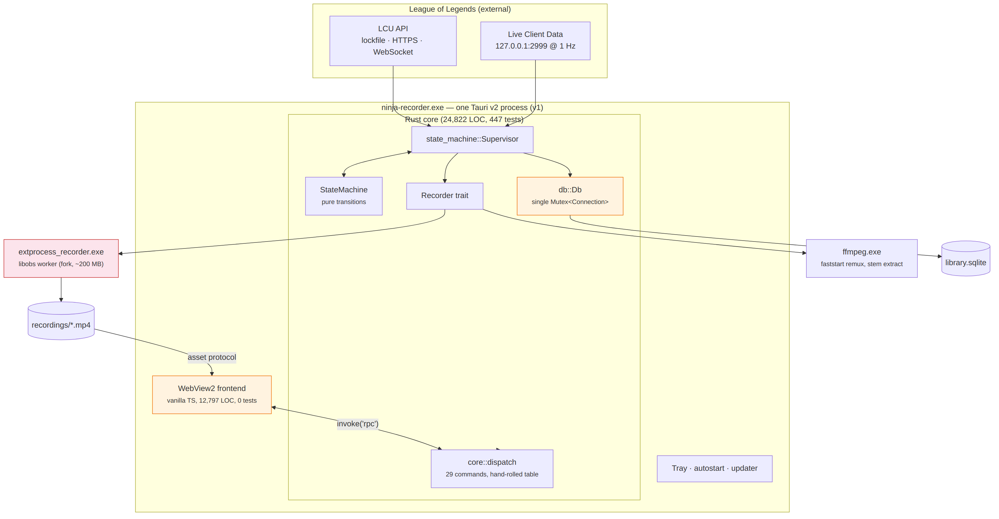

</details>

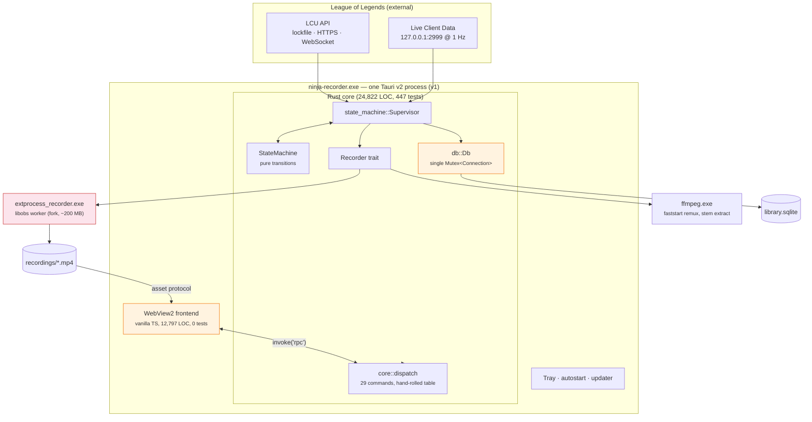
```mermaid
flowchart TB
    subgraph League["League of Legends (external)"]
        LCU["LCU API<br/>lockfile · HTTPS · WebSocket"]
        LIVE["Live Client Data<br/>127.0.0.1:2999 @ 1 Hz"]
    end
    subgraph App["ninja-recorder.exe — one Tauri v2 process (v1)"]
        subgraph Core["Rust core (24,822 LOC, 447 tests)"]
            SUP["state_machine::Supervisor"]
            SM["StateMachine<br/><small>pure transitions</small>"]
            REC["Recorder trait"]
            DB["db::Db<br/><small>single Mutex&lt;Connection&gt;</small>"]
            DISP["core::dispatch<br/><small>29 commands, hand-rolled table</small>"]
        end
        UI["WebView2 frontend<br/><small>vanilla TS, 12,797 LOC, 0 tests</small>"]
        TRAY["Tray · autostart · updater"]
    end
    WORKER["extprocess_recorder.exe<br/><small>libobs worker (fork, ~200 MB)</small>"]
    FF["ffmpeg.exe<br/><small>faststart remux, stem extract</small>"]
    MP4[("recordings/*.mp4")]
    SQL[("library.sqlite")]
    LCU --> SUP
    LIVE --> SUP
    SUP <--> SM
    SUP --> REC
    SUP --> DB
    REC --> WORKER
    REC --> FF
    WORKER --> MP4
    DB --> SQL
    UI <-->|"invoke('rpc')"| DISP
    DISP --> Core
    MP4 -->|asset protocol| UI
    style UI fill:#fff3e0,stroke:#ef6c00
    style WORKER fill:#fce4ec,stroke:#c62828
    style DB fill:#fff3e0,stroke:#ef6c00
```

*Figure 1 — v1 as it is. Orange is what v2 changes; red is what P0 decides.*

### 2.1 Carried forward unchanged

| Asset | Where | Why it matters to the plan |
|---|---|---|
| Pure state machine + async supervisor | `state_machine/machine.rs` (408 LOC), `supervisor.rs` (1,944 LOC) | Moves into the daemon as-is. Its `Action` list is already the seam the event enum hangs off |
| `Recorder` trait with `prepare`/`release` | `recorder/mod.rs`, `libobs/`, `stub.rs` | Every P0 arm plugs in behind it. The stub keeps the whole app testable off Windows |
| `core` module with no `tauri` types | `core/mod.rs` (801 LOC), `core/dispatch.rs` (594 LOC) | The daemon's command surface exists today; only the transport is missing |
| LCU + Live Client clients, fixtures, dev portal | `lcu/`, `live_client/`, `fixtures/`, `dev/` | Unchanged. The dev portal moves to talking to the daemon over the same pipe |
| SQLite schema with 11 migrations | `db/mod.rs` (2,446 LOC) | Appended to, never edited. WS6 changes connection handling, not the schema |
| Retention, reconcile, backfill, match summary, trim | `retention.rs`, `db/reconcile.rs`, `backfill.rs`, `match_summary.rs`, `trim.rs` | Daemon-side. None of it touches the UI directly |
| CI version scheme, alpha channel, signed updater | `.github/workflows/ci.yml`, `scripts/release.mjs` | Unchanged. WS5 adds steps to `test`; WS3 changes what the updater runs *in* |
| Decision log | `DEVELOPMENT.md` (137 KB), `docs/*.md` | Section numbers are cited from ~35 source comments — append, never renumber |
| ffmpeg (LGPL static build, `-c copy` only, separate process) | CI staging step, `lib.rs::ffmpeg_command` | The only copyleft component that survives WS8, and it is compatible with a proprietary distribution as long as it stays a separate process doing stream copies |

### 2.2 Repository findings that shape the plan

| Finding | Consequence |
|---|---|
| `#[tauri::command]` appears 53 times: 29 production commands go through `rpc`, the other ~24 are `dev_*` commands still registered directly | The generator has to cover both. Dev commands stay feature-gated but should join the same declaration so the portal's drift banner can be deleted too |
| `PRAGMA` appears in `db/mod.rs` only for `user_version`; `foreign_keys` is set at open | WS6 is additive: three pragmas plus a connection split |
| `docs/windows-verification.md` records idle RAM at **9 MB working set** (app idle, no League) and install at **248 MB** | The design document says idle RAM was never measured; it was, but as working set with the window closed. WS0 re-measures as Private Bytes, daemon-only, and records both |
| `tauri.devtools.conf.json` overrides `productName` but not `identifier`, so a dev build and a release share `app_data_dir()`, the DB and the recordings folder | The pipe name and the single-instance mutex must be scoped by build identity, or a dev daemon and a release daemon will fight over one pipe |
| Every ffmpeg spawn goes through `lib.rs::ffmpeg_command` (sets `CREATE_NO_WINDOW`); ffmpeg is the **lgpl** build | Moves to the daemon crate unchanged. The lgpl build stays valid under every capture outcome because every call is `-c copy` |
| The main window is created in `setup`, not `tauri.conf.json` (`app.windows: []`), so `--hidden` creates none | The UI process in v2 always creates its window; `--hidden` becomes an alias for "start the daemon only" and can be retired after one release |
| `frontend.md` documents `escapeHtml`/`escapeAttr` as load-bearing because `reconcile` imports untrusted filenames | A framework's default text interpolation replaces both. The Svelte migration must not use `{@html}` on any recording-derived string |
| Clippy runs without `--all-targets` deliberately | Keep that. A generated `event_names()` used only by tests needs the same `cfg_attr(allow(dead_code))` pattern `command_names()` already uses |

## 3. Target architecture

### 3.1 Component view

<!-- diagram: 02-v2-target.png -->

<details><summary>Rendered</summary>

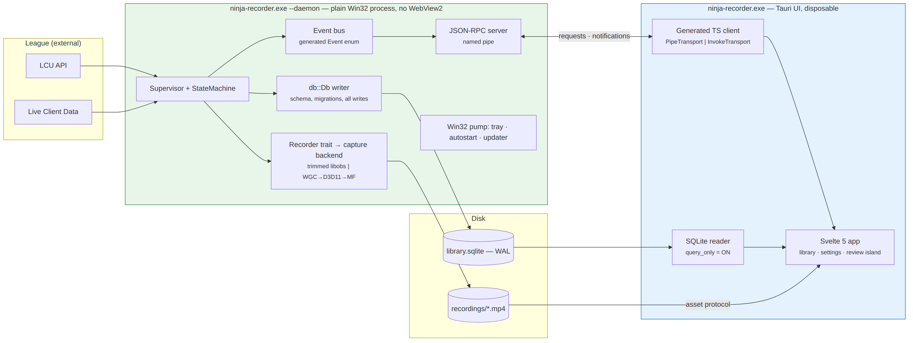

</details>

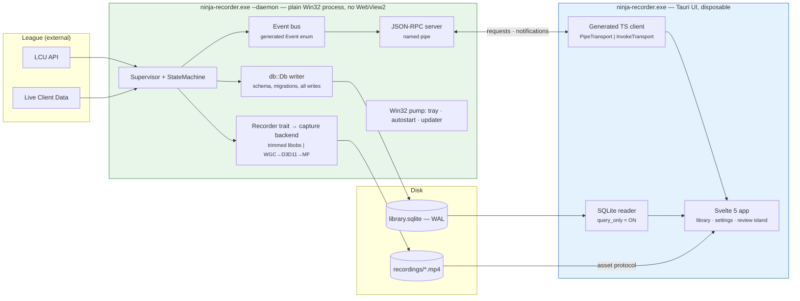
```mermaid
flowchart LR
    subgraph League["League (external)"]
        direction TB
        LCU["LCU API"]
        LIVE["Live Client Data"]
    end
    subgraph D["ninja-recorder.exe --daemon — plain Win32 process, no WebView2"]
        direction TB
        SUP["Supervisor + StateMachine"]
        REC["Recorder trait → capture backend<br/><small>trimmed libobs | WGC→D3D11→MF</small>"]
        DBW["db::Db writer<br/><small>schema, migrations, all writes</small>"]
        EVT["Event bus<br/><small>generated Event enum</small>"]
        RPC["JSON-RPC server<br/><small>named pipe</small>"]
        PUMP["Win32 pump: tray · autostart · updater"]
        SUP --> REC
        SUP --> DBW
        SUP --> EVT
        EVT --> RPC
    end
    subgraph U["ninja-recorder.exe — Tauri UI, disposable"]
        direction TB
        CLI["Generated TS client<br/><small>PipeTransport | InvokeTransport</small>"]
        SV["Svelte 5 app<br/><small>library · settings · review island</small>"]
        DBR["SQLite reader<br/><small>query_only = ON</small>"]
        CLI --> SV
        DBR --> SV
    end
    subgraph Disk["Disk"]
        direction TB
        MP4[("recordings/*.mp4")]
        SQL[("library.sqlite — WAL")]
    end
    LCU --> SUP
    LIVE --> SUP
    RPC <-->|"requests · notifications"| CLI
    REC --> MP4
    DBW --> SQL
    SQL --> DBR
    MP4 -->|"asset protocol"| SV
    style D fill:#e8f5e9,stroke:#2e7d32
    style U fill:#e3f2fd,stroke:#1565c0
```

*Figure 2 — recommended v2 architecture. One binary, two modes. The daemon owns everything that must survive the UI; the UI owns presentation and the two shell integrations that need the foreground session.*

**Ownership, stated once:**

| Concern | Daemon | UI |
|---|---|---|
| Supervisor, state machine, LCU/Live Client watchers | owns | receives `state.changed` events |
| `Recorder` and the capture backend (libobs worker or own backend) | owns | never links it |
| SQLite schema, migrations, every write | owns | own connection, `query_only = ON`, reads library/markers/samples directly |
| Tray icon, autostart Run key, update check + install | owns (needs Win32 pump) | shows update status from events; "Install" is an RPC |
| Log file (`log.rs`) | owns `daemon.log` | owns `ui.log`; both under `app_data_dir()/logs/` |
| Desktop notifications | owns (recording started/ended) | — |
| `open_recordings_folder`, window management | — | owns |
| Dev portal (`devtools` feature) | serves `dev_*` over the pipe | hosts `dev.html` |

### 3.2 Process lifecycle

<!-- diagram: 03-lifecycle.png -->

<details><summary>Rendered</summary>


</details>

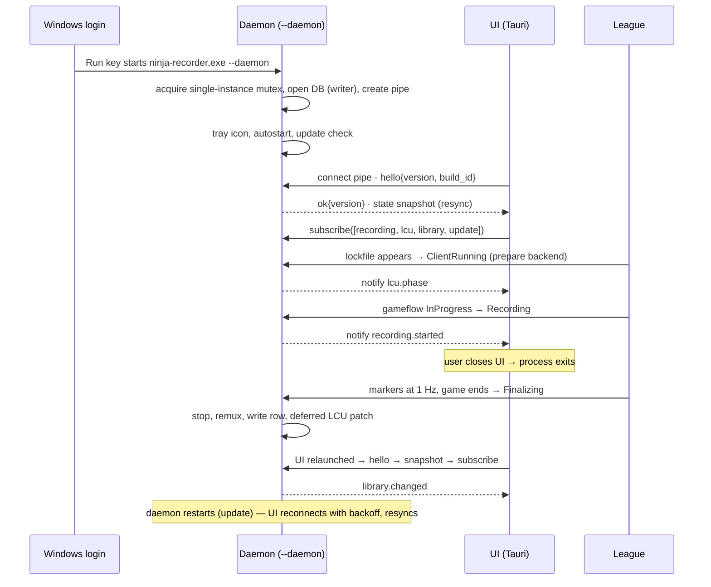
```mermaid
sequenceDiagram
    participant OS as Windows login
    participant D as Daemon (--daemon)
    participant U as UI (Tauri)
    participant L as League
    OS->>D: Run key starts ninja-recorder.exe --daemon
    D->>D: acquire single-instance mutex, open DB (writer), create pipe
    D->>D: tray icon, autostart, update check
    U->>D: connect pipe · hello{version, build_id}
    D-->>U: ok{version} · state snapshot (resync)
    U->>D: subscribe([recording, lcu, library, update])
    L->>D: lockfile appears → ClientRunning (prepare backend)
    D-->>U: notify lcu.phase
    L->>D: gameflow InProgress → Recording
    D-->>U: notify recording.started
    Note over U: user closes UI → process exits
    L->>D: markers at 1 Hz, game ends → Finalizing
    D->>D: stop, remux, write row, deferred LCU patch
    U->>D: UI relaunched → hello → snapshot → subscribe
    D-->>U: library.changed
    Note over D: daemon restarts (update) — UI reconnects with backoff, resyncs
```

*Figure 3 — a normal session. The UI attaching mid-recording is the common case, which is why the snapshot on connect is mandatory rather than an optimisation.*

**Startup rules**

1. The Run key points at `--daemon`. `tauri-plugin-autostart` already writes the path plus a flag; the flag changes from `--hidden` to `--daemon`.
2. Launching the UI with no daemon present starts one (`CreateProcess` on its own path with `--daemon`, detached) and then connects with backoff. This is the recovery path, not the primary one.
3. A second `--daemon` launch finds the named mutex held and exits 0 silently. It never signals the running daemon to quit — it might be recording.
4. The UI refuses to attach to a daemon whose `hello` reports a different app version or build identity, shows "restart required", and offers nothing else. The design document's version-skew argument for one binary only holds if this check exists.

### 3.3 The recording lifecycle inside the daemon

<!-- diagram: 11-state.png -->

<details><summary>Rendered</summary>


</details>

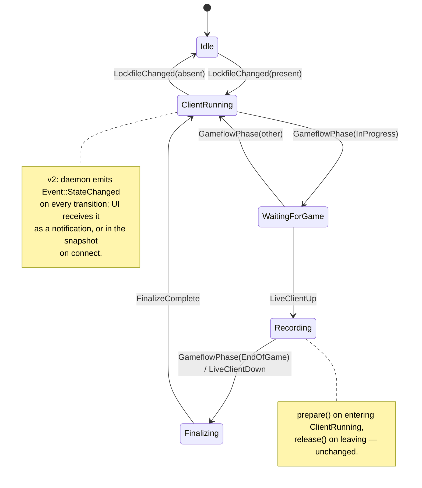
```mermaid
stateDiagram-v2
    [*] --> Idle
    Idle --> ClientRunning: LockfileChanged(present)
    ClientRunning --> Idle: LockfileChanged(absent)
    ClientRunning --> WaitingForGame: GameflowPhase(InProgress)
    WaitingForGame --> Recording: LiveClientUp
    WaitingForGame --> ClientRunning: GameflowPhase(other)
    Recording --> Finalizing: GameflowPhase(EndOfGame) / LiveClientDown
    Finalizing --> ClientRunning: FinalizeComplete
    note right of ClientRunning
        v2: daemon emits Event::StateChanged
        on every transition; UI receives it
        as a notification, or in the snapshot
        on connect.
    end note
    note right of Recording
        prepare() on entering ClientRunning,
        release() on leaving — unchanged.
    end note
```

*Figure 4 — the v1 state machine, unchanged. What v2 adds is that every transition is also an event on the wire.*

The machine, the supervisor and the marker pipeline do not change. The one addition is a hook: `Supervisor` gains an `EventSink` (a trait object, same pattern as `set_library_changed_notifier`) and calls it on every state transition, marker, LCU phase change and library mutation. In `cargo test` the sink is a `Vec`; in the daemon it is the RPC server's broadcast channel.

### 3.4 Repository layout after v2

```
ninja-recorder/
├── src-tauri/                     # the Rust project (workspace root for cargo)
│   ├── rust-toolchain.toml        # NEW — pinned exact version, rustfmt + clippy
│   ├── deny.toml                  # NEW — cargo-deny licences + advisories
│   ├── Cargo.toml                 # edition = "2024"
│   └── src/
│       ├── main.rs                # dispatches on Launch: Daemon | Ui
│       ├── launch.rs              # --daemon now real
│       ├── daemon/                # NEW
│       │   ├── mod.rs             # run(): mutex, DB, pipe, pump, tokio
│       │   ├── pump.rs            # Win32 message loop + tray (from tray.rs)
│       │   ├── rpc.rs             # pipe listener, framing, session, subscriptions
│       │   ├── snapshot.rs        # full-state snapshot for hello/resync
│       │   └── spawn.rs           # UI-side helper: start daemon if absent
│       ├── contract/              # NEW — the single declaration
│       │   ├── mod.rs             # re-exports; #[contract::command] fns live in core
│       │   ├── events.rs          # #[derive(ContractEvent)] enum Event
│       │   └── gen.rs             # TS emitter (cargo run --bin gen-contract)
│       ├── core/                  # unchanged logic; dispatch.rs generated from contract
│       ├── state_machine/         # + EventSink hook
│       ├── recorder/              # + own/ (Option B, default); libobs/ trimmed, deleted in WS8
│       ├── db/                    # + pool.rs (writer + readers), pragmas
│       ├── ui/                    # NEW — Tauri setup, window, invoke transport, open_recordings_folder
│       └── ...                    # lcu, live_client, retention, log, dev — unchanged
├── src/                           # frontend
│   ├── main.ts                    # vanilla shell, shrinking during WS4
│   ├── lib/                       # NEW — Svelte 5
│   │   ├── App.svelte, Library.svelte, Settings.svelte, Review.svelte, Timeline.svelte
│   │   ├── stores/                # $state driven by snapshot + events
│   │   ├── contract/              # GENERATED — types.ts, client.ts, events.ts (committed, CI-checked)
│   │   ├── transport/             # pipe.ts, invoke.ts, mock.ts (Vitest)
│   │   └── styles/tokens.css      # design tokens replacing the 2,013-line global sheet
│   └── dev/                       # portal, now against the generated client
├── biome.json, vitest.config.ts   # NEW
└── .github/workflows/ci.yml       # + biome ci, vitest run, svelte-check, cargo deny, gen-contract --check
```

## 4. Detailed designs

### 4.1 Contract and code generation

<!-- diagram: 04-contract.png -->

<details><summary>Rendered</summary>

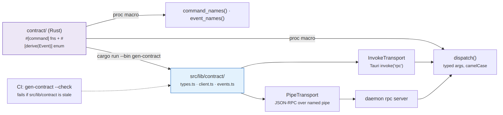

</details>

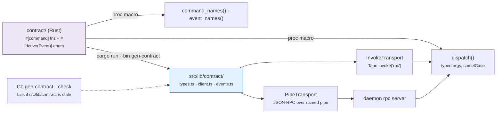
```mermaid
flowchart LR
    DECL["contract/ (Rust)<br/><small>#[command] fns + #[derive(Event)] enum</small>"]
    DECL -->|"proc macro"| DISPATCH["dispatch()<br/><small>typed args, camelCase</small>"]
    DECL -->|"proc macro"| NAMES["command_names() · event_names()"]
    DECL -->|"cargo run --bin gen-contract"| TS["src/lib/contract/<br/><small>types.ts · client.ts · events.ts</small>"]
    TS --> INV["InvokeTransport<br/><small>Tauri invoke('rpc')</small>"]
    TS --> PIPE["PipeTransport<br/><small>JSON-RPC over named pipe</small>"]
    INV --> DISPATCH
    PIPE --> RPCS["daemon rpc server"] --> DISPATCH
    CI["CI: gen-contract --check<br/><small>fails if src/lib/contract is stale</small>"] -.-> TS
    style DECL fill:#ede7f6,stroke:#5e35b1
    style TS fill:#e3f2fd,stroke:#1565c0
```

*Figure 5 — one declaration, both sides generated, and a CI check that the committed TypeScript matches.*

**Approach: finish the existing macro rather than adopt tauri-specta.** The design document lists tauri-specta as "near term" and JSON-RPC as target state. Adopting specta would generate a client that is Tauri-shaped and then need replacing when the pipe lands. The `dispatch_table!` macro is already the declaration; extending it to emit metadata is less work than migrating to a framework and then off it.

**What the declaration carries.** Each row of the table gains what the generator needs and the runtime already has: the argument names and types (present), the return type (currently inferred, must become explicit), and an optional doc string for the TypeScript. The `ctx_result`/`bare_async` shape tokens stay.

```rust
// src-tauri/src/core/dispatch.rs — the same table, now the only declaration
dispatch_table! {
    /// Start a recording now, regardless of game state.
    ctx_result  start_recording() -> RecordingStarted;
    ctx_result  get_recording_markers(recording_id: i64) -> Vec<Marker>;
    ctx_result  set_retention_policy(policy: RetentionPolicy) -> ();
    ctx_async   backfill_match_metadata() -> BackfillReport;
    // ...29 rows, plus the dev_* rows under #[cfg(feature = "devtools")]
}
```

The macro emits, in addition to today's `dispatch`/`dispatch_blocking`/`command_names`/`is_async_command`, a `pub fn contract_manifest() -> Manifest` describing every command's name, argument list and Rust type names. Type *shapes* come from `ts-rs` derives on the serde structs (`#[derive(TS)]` on `Marker`, `RetentionPolicy`, `AudioPreset`, and so on — roughly 40 types across `db`, `recorder::audio`, `live_client::shapes`, `ddragon`, `update`). ts-rs is chosen over writing a type walker because it already handles `Option`, enums with serde tagging, and `rename_all`, which is precisely the nested-case-mismatch failure F3 describes.

**The event half.** A new enum, one variant per thing the daemon pushes, with the same derives:

```rust
// src-tauri/src/contract/events.rs
#[derive(Serialize, Deserialize, TS, ContractEvent)]
#[serde(tag = "type", rename_all = "snake_case")]
pub enum Event {
    StateChanged { state: GameState, since: i64 },
    LcuPhase { phase: Option<GameflowPhase>, client_present: bool },
    RecordingStarted { recording_id: i64, path: String, started_at: i64 },
    RecordingStopped { recording_id: i64, outcome: StopOutcome },
    MarkerAdded { recording_id: i64, marker: Marker },
    SampleBatch { recording_id: i64, samples: Vec<Sample> },
    LibraryChanged { reason: LibraryChangeReason },
    RetentionRan { deleted: u32, freed_bytes: u64 },
    UpdateStatus { status: UpdateStatus },
    DaemonShuttingDown { reason: ShutdownReason },
}
```

`ContractEvent` is a small derive that produces `Event::topic(&self) -> Topic` (the subscription key: `recording`, `lcu`, `library`, `update`, `daemon`) and `event_names()`. Appendix B has the full draft.

**Subscriptions and the snapshot.** The UI subscribes by topic after `hello`. Every event carries a monotonic `seq`. The snapshot returned by `hello` carries `seq_at_snapshot`, so a client can detect a gap after reconnect and re-`hello` rather than trusting a partial stream. `SampleBatch` exists so the 1 Hz advantage samples do not arrive as 2,000 individual notifications over a 35-minute game; the daemon batches every 5 s while a subscriber is present.

**Generation and CI.** `cargo run --bin gen-contract -- --out src/lib/contract` writes three files; `--check` regenerates to a temp dir and diffs. CI fails on drift. The generated files are committed so the frontend builds without a Rust toolchain in the loop, which is the property the vanilla setup had and Vite users expect.

**Transport interface.** The generated client takes a transport at construction:

```ts
// src/lib/transport/index.ts
export interface Transport {
  call<T>(method: string, params: unknown): Promise<T>;
  subscribe(topics: Topic[], onEvent: (e: Event) => void): () => void;
  onDisconnect(cb: (reason: string) => void): void;
}
// invoke.ts wraps invoke("rpc", { command, args }) + listen("event") — v1 behaviour, kept through WS4
// pipe.ts is the JSON-RPC client over a Tauri command that proxies the pipe (WS3)
// mock.ts is scripted responses for Vitest
```

Because WebView2 cannot open a named pipe directly, the UI process's Rust side owns the pipe and the webview reaches it through two thin Tauri commands (`rpc_call`, `rpc_subscribe`) plus a Tauri event for notifications. That is the same shape as today's `rpc` command, so `bridge.ts` changes by one import when WS3 lands.

**Exit criterion.** `every_command_round_trips` and `src/dev/registry.ts`'s hand-maintained mirror are deleted, replaced by `gen-contract --check` and a single generated-client smoke test in Vitest.

### 4.2 Transport: JSON-RPC over a named pipe

<!-- diagram: 05-rpc.png -->

<details><summary>Rendered</summary>


</details>

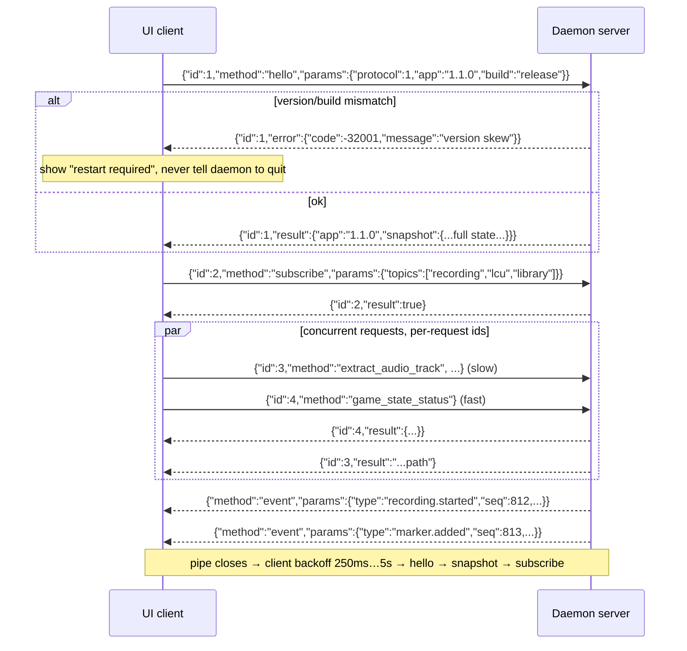
```mermaid
sequenceDiagram
    participant U as UI client
    participant D as Daemon server
    U->>D: {"id":1,"method":"hello","params":{"protocol":1,"app":"1.1.0","build":"release"}}
    alt version/build mismatch
        D-->>U: {"id":1,"error":{"code":-32001,"message":"version skew"}}
        Note over U: show "restart required", never tell daemon to quit
    else ok
        D-->>U: {"id":1,"result":{"app":"1.1.0","snapshot":{...full state...}}}
    end
    U->>D: {"id":2,"method":"subscribe","params":{"topics":["recording","lcu","library"]}}
    D-->>U: {"id":2,"result":true}
    par concurrent requests, per-request ids
        U->>D: {"id":3,"method":"extract_audio_track", ...}   (slow)
        U->>D: {"id":4,"method":"game_state_status"}          (fast)
        D-->>U: {"id":4,"result":{...}}
        D-->>U: {"id":3,"result":"...path"}
    end
    D-->>U: {"method":"event","params":{"type":"recording.started","seq":812,...}}
    D-->>U: {"method":"event","params":{"type":"marker.added","seq":813,...}}
    Note over U,D: pipe closes → client backoff 250ms…5s → hello → snapshot → subscribe
```

*Figure 6 — one session on the wire. Per-request ids are what stop a slow stem extraction from blocking a status poll.*

| Decision | Choice | Reason |
|---|---|---|
| Wire format | JSON-RPC 2.0, one JSON object per line (`\n`-delimited) | serde_json already on both sides; line framing is trivially debuggable with a pipe client and needs no length prefix |
| Pipe name | `\\.\pipe\ninja-recorder.<identifier>.<build>` e.g. `...com.ninjarecorder.app.release` / `.devtools` | Scoped by build identity because dev and release share `app_data_dir()` |
| Pipe ACL | Current user only (`SECURITY_ATTRIBUTES` with a DACL granting the interactive user; no `Everyone`) | The daemon can delete recordings; nothing else on the machine should be able to ask it to |
| Concurrency | Multiple clients (UI, dev portal, a future CLI); one tokio task per connection; requests dispatched via existing `dispatch`/`dispatch_blocking` on `spawn_blocking` | Already the split `is_async_command` exists for |
| Handshake | `hello` is mandatory first; anything else before it is `-32002 not ready` | Version skew check and snapshot in one round trip |
| Notifications | JSON-RPC notification (`method: "event"`, no `id`) | Standard; the generated `events.ts` is the discriminated union |
| Backpressure | Bounded broadcast channel (256); a client that falls behind gets `DaemonShuttingDown`-style `event.lagged { dropped }` and must re-`hello` | A stuck UI must never stall the supervisor |
| Reconnect | Client: exponential backoff 250 ms → 5 s, jittered, indefinitely; on connect, `hello` → apply snapshot → `subscribe` | The exit criterion for WS3 is literally this loop working while a recording is in flight |
| Error model | `-32601` unknown method, `-32602` bad args (the current `"bad arguments for X: ..."` string), `-32001` version skew, `-32002` not ready, `-32000` command error with the `Result<_, String>` message | Maps 1:1 onto what `dispatch` already returns |

Named pipes on Windows via `tokio::net::windows::named_pipe` (`ServerOptions`/`ClientOptions`) — already in the tokio version in use, no new dependency. On non-Windows dev boxes the same code paths compile against a Unix domain socket under `#[cfg(unix)]`, which keeps the daemon and its RPC tests runnable in the seconds-long loop.

### 4.3 The daemon process

The daemon is a plain Win32 process: no Wry, no WebView2, no window. Because it owns the tray icon it needs a message pump, which is the concrete reason it is not just `#[tokio::main]`.

```rust
// src-tauri/src/daemon/mod.rs (shape, not final code)
pub fn run(cfg: DaemonConfig) -> anyhow::Result<()> {
    let _guard = SingleInstance::acquire(&cfg.mutex_name)?;   // exits 0 if held
    log::init(cfg.logs_dir.join("daemon.log"))?;
    let db = db::Pool::open_writer(&cfg.db_path)?;             // migrations run here, once
    let ctx = core::Ctx::new(recorder, supervisor, db, ...);   // unchanged type
    let rt = tokio::runtime::Builder::new_multi_thread().build()?;
    let (events_tx, _) = broadcast::channel(256);
    ctx.supervisor.set_event_sink(Box::new(BroadcastSink(events_tx.clone())));
    rt.spawn(rpc::serve(cfg.pipe_name, ctx.clone(), events_tx.clone()));
    rt.spawn(update::schedule(ctx.clone()));                   // moved from lib.rs
    pump::run(tray::build(ctx.clone()))?;                      // blocks on GetMessage until WM_QUIT
    ctx.supervisor.shutdown_blocking();                        // stop recording cleanly, release backend
    Ok(())
}
```

**Tray.** `tray.rs` today uses Tauri's `TrayIconBuilder`. Without Tauri the choice is the `tray-icon` crate directly (the same crate Tauri wraps, by the same authors) plus `muda` for the menu, and a `GetMessage`/`DispatchMessage` loop on the main thread. Menu actions post to a `std::sync::mpsc` the pump drains; "Open" spawns the UI process, "Quit" asks the supervisor whether a recording is in flight and confirms via a notification before posting `WM_QUIT`.

**Updater.** `tauri-plugin-updater` is Tauri-bound. The daemon needs the same behaviour without an `AppHandle`: fetch `latest.json`/`alpha.json`, verify the minisign signature against the baked public key, download the NSIS installer, and run it with `/S` once no recording is in flight and the UI has been told to close. Two options, in preference order:

1. Use `tauri-plugin-updater`'s underlying logic through a `tauri::App` built headless in the daemon — rejected, because it drags Wry into the daemon binary and the dead-at-load `comctl32` problem `core` was designed to avoid.
2. Reimplement the ~200-line check/verify/download/launch path with `reqwest` + `minisign-verify` (a tiny crate) — chosen. `update.rs` already isolates the state machine (`Unsupported | Idle | Available | Downloading | Ready`); only the fetch/verify/launch seam changes.

The rule "never install during a recording" is now enforced by the process that knows about the recording, which is the whole point of moving it.

**Shutdown ordering.** `WM_QUIT` → stop accepting RPC → emit `DaemonShuttingDown` → `Supervisor::shutdown` (stops the recorder, which runs the faststart remux, then finalizes the row) → drop the writer connection (WAL checkpoint) → exit. Killing the daemon with a recording in flight leaves a playable fragmented MP4 and a row `reconcile` will pick up, which is today's crash behaviour and stays the guarantee.

**What the UI process keeps.** `ui/mod.rs` holds today's `lib.rs` minus the supervisor: window creation, the `rpc_call`/`rpc_subscribe` proxies, `open_recordings_folder`, `dev_open_portal`, the asset protocol scope, and the "start the daemon if absent" recovery. It opens its own `query_only` SQLite connection for reads (§4.4) so the library view does not round-trip 1,000 rows through the pipe.

### 4.4 Persistence

<!-- diagram: 06-db.png -->

<details><summary>Rendered</summary>

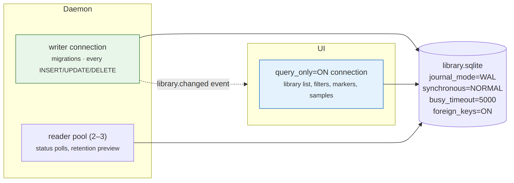

</details>

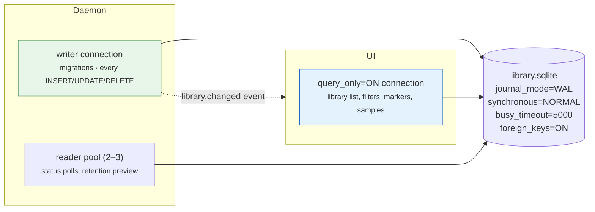
```mermaid
flowchart LR
    subgraph Daemon
        W["writer connection<br/><small>migrations · every INSERT/UPDATE/DELETE</small>"]
        RP["reader pool (2–3)<br/><small>status polls, retention preview</small>"]
    end
    subgraph UI
        Q["query_only=ON connection<br/><small>library list, filters, markers, samples</small>"]
    end
    F[("library.sqlite<br/>journal_mode=WAL<br/>synchronous=NORMAL<br/>busy_timeout=5000<br/>foreign_keys=ON")]
    W --> F
    RP --> F
    Q --> F
    W -.->|"library.changed event"| UI
    style W fill:#e8f5e9,stroke:#2e7d32
    style Q fill:#e3f2fd,stroke:#1565c0
```

*Figure 7 — one writer, several readers, WAL in between.*

Changes to `db/mod.rs`, in order:

1. **Pragmas on every connection at open:** `journal_mode = WAL` (persistent; set once by the writer), `synchronous = NORMAL`, `busy_timeout = 5000`, `foreign_keys = ON`. The UI adds `query_only = ON`. Migrations continue to run on the writer only, guarded by the `user_version` check that already exists.
2. **`db::Pool`** replaces `Mutex<Connection>`: one `Mutex<Connection>` for writes plus an `r2d2`-free hand-rolled pool of two or three read connections (a `Vec<Mutex<Connection>>` with round-robin is enough at this scale). `Db`'s public API is unchanged; write methods take the writer, read methods take a reader. That is a mechanical audit of ~60 methods.
3. **Reads in the UI** go through the same `Db` type opened in reader mode. `list_recordings`, `get_recording_markers`, `get_recording_samples`, `get_disk_usage` and the filter/stat queries are answered locally; the UI still *invalidates* off `LibraryChanged`. Every mutating command stays an RPC.
4. **Retention and `reconcile`** are daemon-only and unchanged.

The design document's warning stands: do not open the UI connection read-only at the file level. `query_only` is the discipline; the shm index needs write access to exist.

### 4.5 Capture backend — the P0 arms

<!-- diagram: 07-capture.png -->

<details><summary>Rendered</summary>

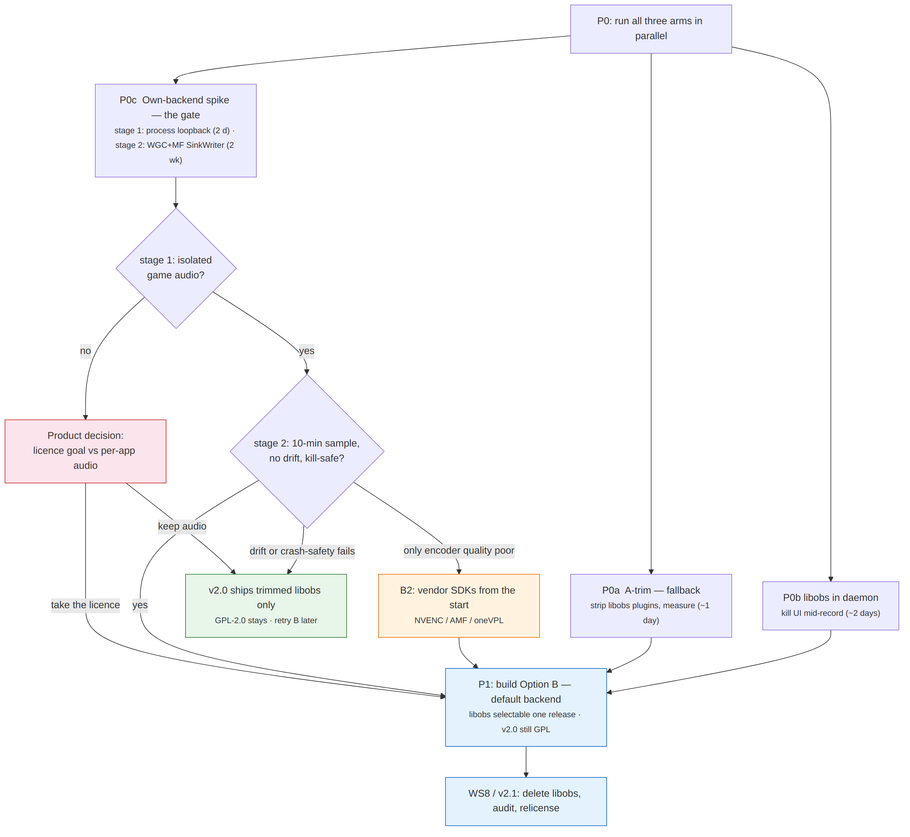

</details>

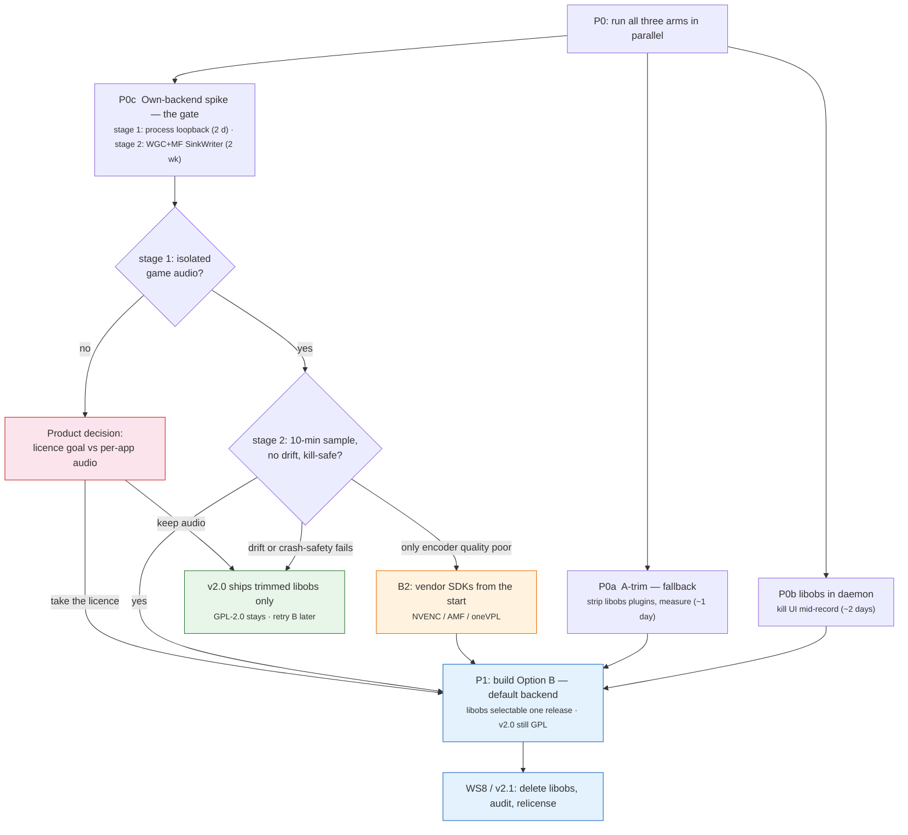
```mermaid
flowchart TB
    START["P0: run all three arms in parallel"] --> C["P0c  Own-backend spike — the gate<br/><small>stage 1: process loopback (2 d) · stage 2: WGC+MF SinkWriter (2 wk)</small>"]
    START --> A["P0a  A-trim — fallback<br/><small>strip libobs plugins, measure (~1 day)</small>"]
    START --> B["P0b  libobs in daemon<br/><small>kill UI mid-record (~2 days)</small>"]
    C --> S1{"stage 1: isolated<br/>game audio?"}
    S1 -->|no| PROD["Product decision:<br/>licence goal vs per-app audio"]
    PROD -->|"keep audio"| KEEP["v2.0 ships trimmed libobs only<br/><small>GPL-2.0 stays · retry B later</small>"]
    PROD -->|"take the licence"| OWN
    S1 -->|yes| S2{"stage 2: 10-min sample,<br/>no drift, kill-safe?"}
    S2 -->|"yes"| OWN["P1: build Option B — default backend<br/><small>libobs selectable one release · v2.0 still GPL</small>"]
    S2 -->|"only encoder quality poor"| B2["B2: vendor SDKs from the start<br/><small>NVENC / AMF / oneVPL</small>"] --> OWN
    S2 -->|"drift or crash-safety fails"| KEEP
    A --> OWN
    B --> OWN
    OWN --> REL["WS8 / v2.1: delete libobs, audit, relicense"]
    style OWN fill:#e3f2fd,stroke:#1565c0
    style REL fill:#e3f2fd,stroke:#1565c0
    style KEEP fill:#e8f5e9,stroke:#2e7d32
    style B2 fill:#fff3e0,stroke:#ef6c00
    style PROD fill:#fce4ec,stroke:#c62828
```

*Figure 8 — the P0 gate. Blue is the target; green is the fallback. Both share every other workstream.*

#### Why Option B is the target

GPL-2.0 is inherited from libobs and from nothing else. A closed-source or source-available future is impossible while libobs ships in the installer, whatever process it lives in — the arms-length argument in the design document is contested and is not relied on here. The maintainer's own code in `src-tauri/` and `src/` can be relicensed at any time by its copyright holder; the only constraint is that a libobs-linked build cannot be *distributed* under anything but GPL-2.0. So the sequence is fixed: build the own backend, ship it alongside libobs for one release, delete libobs, then change the licence. Trimmed libobs is kept purely as insurance, because it records real games today and Option B does not yet.

#### P0a — trim the libobs bundle (≈1 day, build-script work) — fallback arm

Still worth running: if P0c fails, this is what ships, and it must be under 200 MB either way for the one release in which both backends coexist. The CI step "Stage libobs capture backend" copies the fork's entire `build-helper/libobs_<ver>/` directory. The task is a keep-list applied after that copy, then a real recording from the result.

| Keep | Drop |
|---|---|
| `obs.dll`, `obs-frontend-api` is **not** needed, `libobs-d3d11.dll`, `libobs-winrt.dll` (WGC), `w32-pthreads.dll` | `obs-browser/` and its CEF payload (the single largest item) |
| plugins: `win-capture`, `win-wasapi`, `obs-ffmpeg`, `obs-outputs`, `obs-x264` **only if** the no-silent-fallback rule needs it present to enumerate (it does not — drop), `obs-nvenc`, `obs-qsv11`, `enc-amf` / `obs-amf` | `obs-vst`, `obs-websocket`, `obs-filters`, `obs-transitions`, `image-source`, `text-freetype2`, `obs-text`, `vlc-video`, `decklink`, `rtmp-services`, `aja`, every locale except `en-US` |
| `data/libobs/` effect files (`.effect`), `data/obs-plugins/<kept>/` | `data/obs-plugins/<dropped>/`, `data/obs-studio/themes`, docs |
| ffmpeg DLLs the kept plugins import (`avcodec`, `avformat`, `avutil`, `swresample`, `swscale`) | `avfilter`, `avdevice`, `postproc` if nothing imports them (verify with `dumpbin /dependents`) |
| `ffmpeg.exe` (lgpl static build, for remux) | — |

Method: apply the keep-list in a PowerShell step behind `LIBOBS_TRIM=1`, build the devtools installer, install, record a full game, check the log for plugin-load failures, then `Get-ChildItem -Recurse | Measure-Object Length -Sum`. If the number is under 200 MB with a clean recording, A-trim passes. Appendix C carries the candidate list with the verification order.

#### P0b — libobs in the daemon (≈2 days)

Move `LibObsRecorder` construction from `lib.rs::setup` into `daemon::run` behind the same `cfg(windows)`, launch the UI, start a recording (dev portal), kill the UI process from Task Manager, and confirm the recording continues and finalizes. Record daemon-only Private Bytes and Working Set at idle, and the two-process total with the UI open. This arm is cheap because the worker is already a separate process; the work is ownership, not FFI.

#### P0c — own-backend spike (2 days + 2 weeks) — the go/no-go gate

**Stage 1, process loopback (2 days).** A standalone `cargo run --bin spike-loopback` on Windows: `ActivateAudioInterfaceAsync` with `AUDIOCLIENT_ACTIVATION_TYPE_PROCESS_LOOPBACK`, `PROCESS_LOOPBACK_MODE_INCLUDE_TARGET_PROCESS_TREE`, root PID = `League of Legends.exe` (found the way `recorder/libobs/window.rs` already finds the window, then `GetWindowThreadProcessId`). Capture 60 s to a WAV while the game runs with Discord open. Pass if the WAV contains game audio and no Discord audio. This answers the first open question in the design document's §9 directly, including which PID is the root: the game process, not the client the LCU tracks.

**Stage 2, WGC → D3D11 → MF SinkWriter (2 weeks).** Extend the spike: `GraphicsCaptureItem` for the game window, `Direct3D11CaptureFramePool` (BGRA), a compute/pixel shader pass to NV12, `IMFSinkWriter` with `MF_TRANSCODE_CONTAINERTYPE = MPEG4`, `MF_MP4_FRAGMENTED`-style output via `MFCreateFMPEG4MediaSink`, H.264 via `MFT_ENUM_FLAG_HARDWARE` with vendor-ID check (refuse on none), AAC per track, a cadence thread duplicating frames to hold 60 fps CFR, and a resampler placing mic, loopback and system audio on one clock. Record 10 minutes; pass if audio drift against video is under one frame at the end, the file is playable when the process is killed at minute 5, and the encoder enumeration identifies NVENC/AMF/QSV on at least two vendors.

**Gate rule.** Option B proceeds to P1 if **both** P0c stages pass. If stage 1 (process loopback) fails, per-application game audio cannot be delivered without libobs; that is a product regression across every audio preset, and the maintainer must choose between the licence goal and the feature before anything else in WS1 continues. If stage 2 fails only on encoder quality, Option B continues with the B2 variant (direct NVENC/AMF/oneVPL) from the start. If stage 2 fails on drift or crash-safety, trimmed libobs ships as v2.0's only backend, the licence stays GPL-2.0, and the spike is archived under `docs/spikes/` with its measurements for a second attempt. Under no outcome does v2 ship a branch-pinned private fork.

The spike is not throwaway on the pass path: its pipeline is the seed of `recorder/own/`, so write it under edition 2024 rules (WS5 lands first) and keep the audio clock-alignment code testable off Windows with recorded WASAPI timestamps.

#### P1 — build Option B (≈4 weeks)

- **`recorder/own/`** implements `Recorder` with the spike's pipeline: `capture.rs` (WGC item + frame pool), `convert.rs` (BGRA→NV12 shader, cross-adapter copy when capture and encode devices differ), `pacing.rs` (CFR cadence thread), `audio/` (per-endpoint WASAPI capture, process loopback, resampling onto the video clock), `encode.rs` (MFT enumeration with vendor-ID check, refuse on none), `mux.rs` (SinkWriter, fragmented MP4, per-track AAC), `remux.rs` (existing ffmpeg faststart pass, unchanged).
- **Same contract above the trait.** `RecordConfig`, `AudioLayout` and `RecordingOutput` do not change, so the library, the stem picker and the review player cannot tell which backend wrote a file.
- **Backend selection** via a `settings_kv` key (`capture_backend = own | libobs`), default `own`, surfaced in Settings → Advanced with a one-line explanation. This is the design document's "keep libobs selectable for one release cycle" mitigation and it is what makes v2.0 shippable before Option B has months of field time.
- **Trimmed libobs** as the fallback: the P0a keep-list becomes the CI staging step; `libobs-recorder` pinned to a tag on a published crate (or upstream after the two patches land), never a branch; `LibObsRecorder` moves into the daemon crate. Its removal is WS8.
- **Diagnostics** record `backend` in `diagnostics_json` (the column already exists) so a bad recording can be attributed.

### 4.6 Frontend

<!-- diagram: 10-frontend.png -->

<details><summary>Rendered</summary>

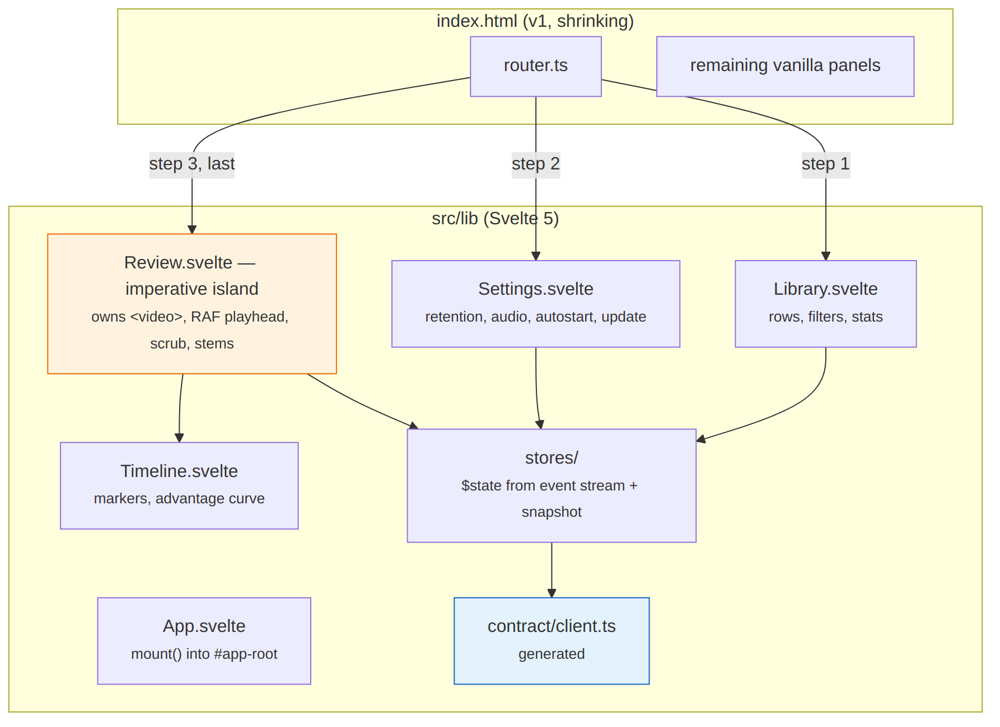

</details>

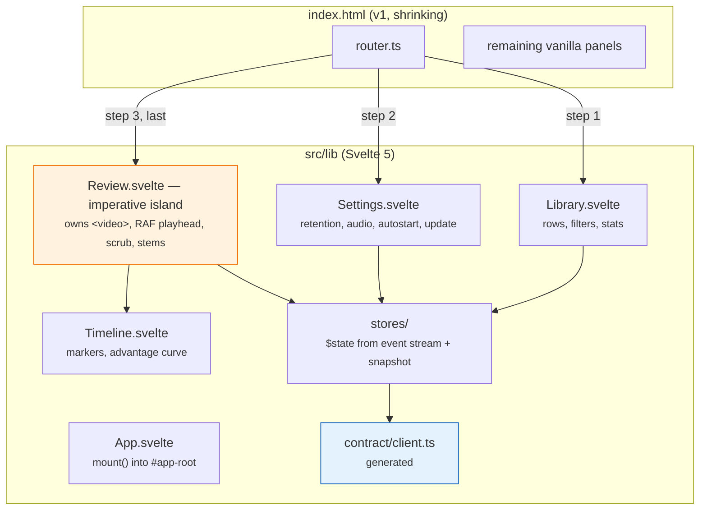
```mermaid
flowchart TB
    subgraph Vanilla["index.html (v1, shrinking)"]
        ROUTER["router.ts"]
        REST["remaining vanilla panels"]
    end
    subgraph Svelte["src/lib (Svelte 5)"]
        APP["App.svelte<br/><small>mount() into #app-root</small>"]
        LIB["Library.svelte<br/><small>rows, filters, stats</small>"]
        SET["Settings.svelte<br/><small>retention, audio, autostart, update</small>"]
        REV["Review.svelte — imperative island<br/><small>owns &lt;video&gt;, RAF playhead, scrub, stems</small>"]
        TL["Timeline.svelte<br/><small>markers, advantage curve</small>"]
        STORES["stores/<br/><small>$state from event stream + snapshot</small>"]
        CLIENT["contract/client.ts<br/><small>generated</small>"]
    end
    ROUTER -->|"step 1"| LIB
    ROUTER -->|"step 2"| SET
    ROUTER -->|"step 3, last"| REV
    REV --> TL
    LIB --> STORES
    SET --> STORES
    REV --> STORES
    STORES --> CLIENT
    style REV fill:#fff3e0,stroke:#ef6c00
    style CLIENT fill:#e3f2fd,stroke:#1565c0
```

*Figure 9 — the strangler. Each view is replaced at its root DOM node; the router keeps working throughout.*

**Setup (WS4, first week).** `@sveltejs/vite-plugin-svelte`, `svelte` 5, `svelte-check`. `index.html` keeps its markup; each view's root element becomes the `target` of a `mount()` call when the router switches to it, and `unmount()` on leave. Nothing else in `main.ts` changes on day one.

**Order and why:**

1. **Library** (`library.ts`, 855 LOC → `Library.svelte` + `Row.svelte` + `Filters.svelte` + `Stats.svelte`). Highest churn, most templating, most `escapeHtml` calls; the biggest immediate win and the easiest to check against fixtures — the dev portal's seed panel produces every row shape the format helpers document.
2. **Settings + update** (`settings.ts` 540 LOC, `update.ts` 280 LOC). Forms, which a framework does best. The retention preview and audio preset picker are RPCs already.
3. **Review player last** (`review.ts`, 1,547 LOC, ~30 module-scope mutables). `Review.svelte` is an *imperative island*: it binds `<video>` and the timeline canvas via `bind:this`, runs the RAF playhead, scrub handling and stem `<audio>` synchronisation in plain functions exactly as today, and exposes only props (`recording`, `markers`, `samples`) and events (`seek`, `clip`). Svelte manages its lifetime and nothing inside it. The timeline clustering and marker grouping move to pure functions under `src/lib/timeline/` first, with Vitest coverage, before the port — that is the regression net the design document's risk register asks for.

**Stores.** One `$state` object per topic (`recordingState`, `lcuState`, `library`, `update`), populated from the `hello` snapshot and mutated by events. Components read stores; they never call the client for state they can be told about. Reads that are genuinely on demand (`get_recording_markers` for the selected VOD) go through the generated client.

**Styling.** `src/lib/styles/tokens.css` carries the custom properties `theme.ts` already switches on `html[data-theme]`; component styles are scoped. The 2,013-line `styles.css` shrinks as each view moves and is deleted with the last vanilla panel. `theme.ts`'s `matchMedia` listener is kept verbatim.

**Safety.** No `{@html}` anywhere a recording-derived string can reach. Biome's `noDangerouslySetInnerHtml`-equivalent for Svelte is not available, so a two-line Vitest test greps `src/lib` for `{@html` and fails if it appears outside an allow-list.

**Dev portal.** `src/dev/` is left vanilla for v2 — it is a debugging surface with 3,700 lines and no user-facing pressure. It does move onto the generated client (`registry.ts` is deleted; its help text becomes doc comments in the Rust declaration).

### 4.7 Toolchain and quality gates

| Change | Concretely | Notes |
|---|---|---|
| Pin the compiler | `src-tauri/rust-toolchain.toml`: `channel = "1.9x.y"`, `components = ["rustfmt","clippy"]`; CI uses `dtolnay/rust-toolchain` with no version argument so it reads the file | Bump in its own PR; new lints are the expected content of that diff |
| Edition 2024 | `cargo fix --edition` from `src-tauri/`, then `edition = "2024"`, then fix the `unsafe_op_in_unsafe_fn` backlog in `recorder/libobs/`, `recorder/devices.rs`, `worker_log.rs`; restructure any `static mut` | Land *before* WS1's P1 so the new capture code is written under the new rules |
| cargo-deny | `deny.toml` with `[licenses] allow = ["MIT", "Apache-2.0", "BSD-*", "ISC", "Zlib", "Unicode-3.0"]`, `deny = ["GPL-*", "AGPL-*"]`, and a single named exception for `libobs-recorder` until WS8 removes it; `[advisories]`; `cargo deny check` in CI | Makes the licence exit mechanical: deleting the exception is what proves no GPL dependency remains |
| Biome | `biome.json` with the recommended set plus `noNonNullAssertion` off (the DOM code uses it deliberately); `biome ci .` in CI | One binary for lint and format; replaces nothing because nothing exists |
| Vitest | `vitest.config.ts`; first targets are the pure modules: `format.ts` (242 LOC), the timeline clustering and marker grouping once extracted, `router.ts`; then component tests in browser mode for `Row.svelte` and `Filters.svelte` | Mocked transport from `src/lib/transport/mock.ts` |
| svelte-check | `npx svelte-check --tsconfig ./tsconfig.json` alongside `tsc --noEmit` | `tsc` does not see `.svelte` files; without this the type gate silently narrows |
| Contract drift | `cargo run --bin gen-contract -- --check` | Replaces `every_command_round_trips` and the registry banner |

CI `test` job after WS5, in order: `npm ci` → `biome ci .` → `tsc --noEmit` → `svelte-check` → `vitest run` → `cargo deny check` → `cargo run --bin gen-contract -- --check` → the four existing cargo steps. Clippy still runs without `--all-targets`, and the reason stays documented in `CLAUDE.md`.

## 5. Workstreams and task breakdown

<!-- diagram: 08-deps.png -->

<details><summary>Rendered</summary>

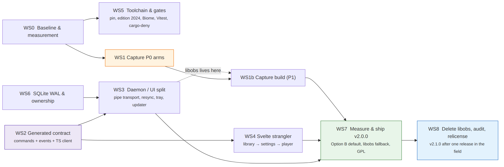

</details>

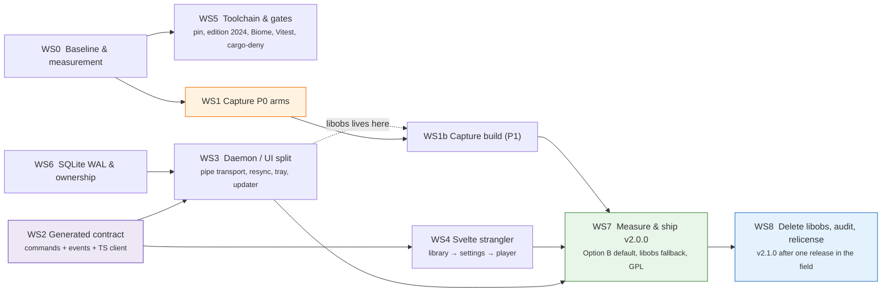
```mermaid
flowchart LR
    WS0["WS0  Baseline & measurement"] --> WS5
    WS0 --> WS1
    WS1["WS1  Capture P0 arms"] --> WS1b["WS1b  Capture build (P1)"]
    WS5["WS5  Toolchain & gates<br/><small>pin, edition 2024, Biome, Vitest, cargo-deny</small>"]
    WS2["WS2  Generated contract<br/><small>commands + events + TS client</small>"] --> WS3
    WS2 --> WS4
    WS6["WS6  SQLite WAL & ownership"] --> WS3
    WS3["WS3  Daemon / UI split<br/><small>pipe transport, resync, tray, updater</small>"] --> WS7
    WS4["WS4  Svelte strangler<br/><small>library → settings → player</small>"] --> WS7
    WS1b --> WS7["WS7  Measure & ship v2.0.0<br/><small>Option B default, libobs fallback, GPL</small>"]
    WS7 --> WS8["WS8  Delete libobs, audit, relicense<br/><small>v2.1.0 after one release in the field</small>"]
    WS3 -.->|"libobs lives here"| WS1b
    style WS1 fill:#fff3e0,stroke:#ef6c00
    style WS2 fill:#ede7f6,stroke:#5e35b1
    style WS7 fill:#e8f5e9,stroke:#2e7d32
    style WS8 fill:#e3f2fd,stroke:#1565c0
```

*Figure 10 — dependencies. WS0, WS1, WS2, WS5 and WS6 have no upstream and can all start in week one. WS8 is deliberately a separate release.*

<!-- diagram: 09-gantt.png -->

<details><summary>Rendered</summary>

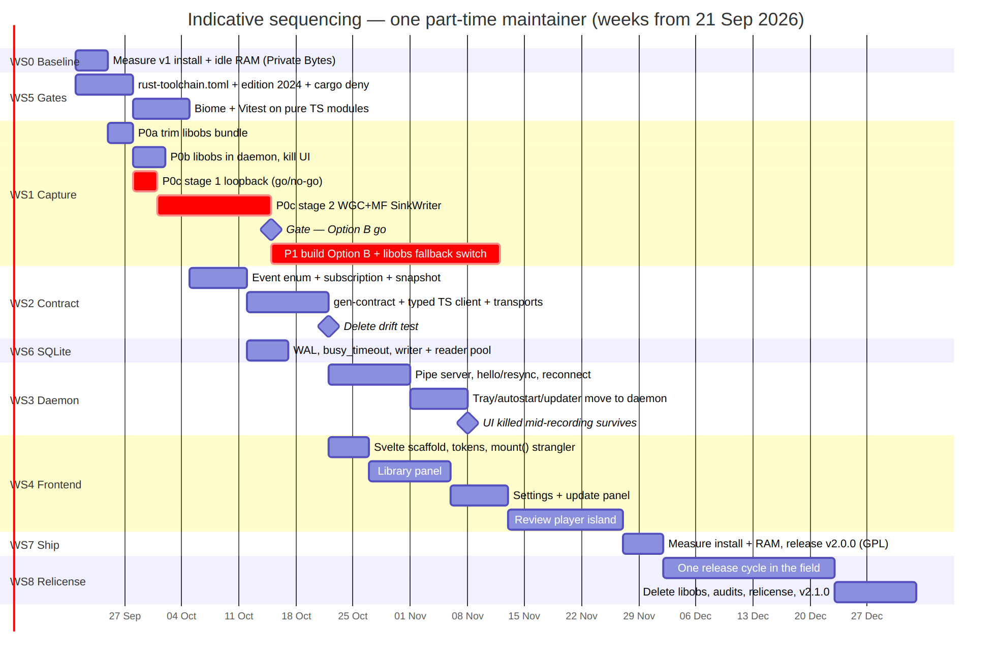

</details>

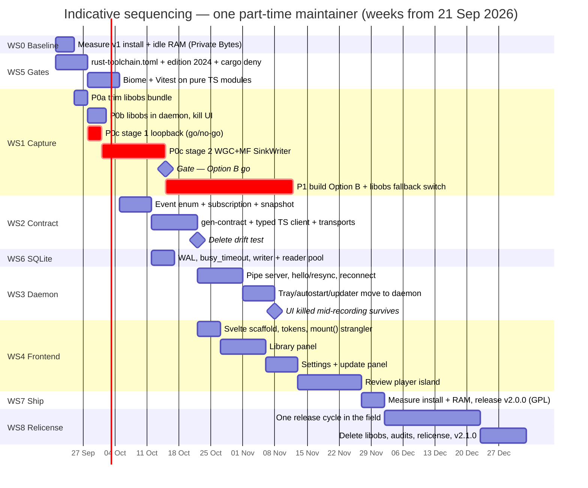
```mermaid
gantt
    title Indicative sequencing — one part-time maintainer (weeks from 21 Sep 2026)
    dateFormat  YYYY-MM-DD
    axisFormat  %d %b
    section WS0 Baseline
    Measure v1 install + idle RAM (Private Bytes)     :ws0, 2026-09-21, 4d
    section WS5 Gates
    rust-toolchain.toml + edition 2024 + cargo deny    :ws5a, 2026-09-21, 7d
    Biome + Vitest on pure TS modules                   :ws5b, after ws5a, 7d
    section WS1 Capture
    P0a trim libobs bundle                             :ws1a, 2026-09-25, 3d
    P0b libobs in daemon, kill UI                       :ws1b, after ws1a, 4d
    P0c stage 1 loopback (go/no-go)                     :crit, ws1c, 2026-09-28, 3d
    P0c stage 2 WGC+MF SinkWriter                       :crit, ws1d, after ws1c, 14d
    Gate — Option B go                                  :milestone, m1, after ws1d, 0d
    P1 build Option B + libobs fallback switch          :crit, ws1e, after m1, 28d
    section WS2 Contract
    Event enum + subscription + snapshot                :ws2a, 2026-10-05, 7d
    gen-contract + typed TS client + transports         :ws2b, after ws2a, 10d
    Delete drift test                                   :milestone, m2, after ws2b, 0d
    section WS6 SQLite
    WAL, busy_timeout, writer + reader pool             :ws6, 2026-10-12, 5d
    section WS3 Daemon
    Pipe server, hello/resync, reconnect                :ws3a, after m2, 10d
    Tray/autostart/updater move to daemon               :ws3b, after ws3a, 7d
    UI killed mid-recording survives                    :milestone, m3, after ws3b, 0d
    section WS4 Frontend
    Svelte scaffold, tokens, mount() strangler          :ws4a, after m2, 5d
    Library panel                                       :ws4b, after ws4a, 10d
    Settings + update panel                             :ws4c, after ws4b, 7d
    Review player island                                :ws4d, after ws4c, 14d
    section WS7 Ship
    Measure install + RAM, release v2.0.0 (GPL)         :ws7, after ws4d, 5d
    section WS8 Relicense
    One release cycle in the field                      :ws8a, after ws7, 21d
    Delete libobs, audits, relicense, v2.1.0            :ws8b, after ws8a, 10d
```

*Figure 11 — an indicative calendar. Durations are calendar days at part-time effort, not engineering days. The critical path runs through WS1.*

**Additive workstreams.** Added under [ADR 0004](../decisions/0004-add-ws9-vod-review.md); not drawn in Figures 10 or 11, and off the critical path.

| WS | Runs beside | Gated by |
|---|---|---|
| WS9 P0 — schema, review form, spreadsheet import | May run in parallel with the WS1–WS3 spikes | The schema only |
| WS9 P1–P4 — notes on the player, objectives widget, blocks and retention, exports | After its upstreams, in phase order | WS2, WS3, WS4, WS6 |

### WS0 — Baseline and measurement

| # | Task | Exit criterion |
|---|---|---|
| 0.1 | Add `docs/measurement.md` with the Appendix A method from the design document (Private Bytes headline, Working Set alongside, daemon-only resting state, two-process total separately) | Merged |
| 0.2 | Measure v1 0.8.0: install size, Private Bytes and Working Set with window closed, with window open, with League client open (backend warm) | Three rows recorded in `docs/windows-verification.md §5` |
| 0.3 | Script the measurement (`scripts/measure.ps1`) so WS7 repeats it identically | Script committed and run once |

### WS1 — Capture backend

| # | Task | Exit criterion |
|---|---|---|
| 1.1 | P0a keep-list PowerShell step behind `LIBOBS_TRIM=1`; devtools installer; real game | Recording plays; size recorded; plugin-load log clean |
| 1.2 | P0b `LibObsRecorder` constructed by a `--daemon` process; UI killed mid-record | Recording finalizes; daemon-only RAM recorded |
| 1.3 | P0c-1 loopback spike binary; 60 s WAV with Discord open | Game audio present, Discord absent, root PID documented |
| 1.4 | P0c-2 WGC+MF spike; 10-minute sample; kill at minute 5 | Drift < 1 frame; killed file playable; vendor detection on ≥2 GPUs |
| 1.5 | Gate outcome recorded in `DEVELOPMENT.md §16` (new section; do not renumber): loopback root PID, drift figure, encoder vendors seen, decision | Merged |
| 1.6 | P1: `recorder/own/` behind `Recorder` in the daemon crate, default backend | Full game on real hardware from a CI-built installer, isolated game audio, seekable after remux |
| 1.7 | Fallback: trimmed libobs staged from the P0a keep-list; fork pin replaced by a tag; `capture_backend` switch in Settings | Both backends record the same game; `windows-verification.md` gains a backend-comparison table |
| 1.8 | B2 path only if 1.4 flagged encoder quality: direct NVENC/AMF/oneVPL behind `encode.rs` | Quality-per-bitrate within 10% of libobs at 8 Mbps by visual comparison of the same game |

### WS2 — Generated contract

| # | Task | Exit criterion |
|---|---|---|
| 2.1 | Add `-> ReturnType` to every `dispatch_table!` row; macro emits `contract_manifest()` | `cargo test` green, no behaviour change |
| 2.2 | `ts-rs` derives on every type crossing the boundary (~40); `#[ts(export)]` disabled in favour of the generator collecting them | Types compile |
| 2.3 | `contract/events.rs` with `Event`, `Topic`, `ContractEvent` derive; `EventSink` on `Supervisor`; emit on every transition, marker, LCU phase, library change, retention run, update status | Unit test asserts one event per state transition against the fixture-driven supervisor test |
| 2.4 | `contract/snapshot.rs`: `Snapshot { seq, state, lcu, current_recording, update, prefs }` assembled from `Ctx` | Round-trips through serde |
| 2.5 | `gen-contract` binary: emits `types.ts`, `client.ts` (one method per command, camelCase args, typed return), `events.ts` (discriminated union + `Topic`); `--check` mode | Generated output committed; `--check` passes |
| 2.6 | `src/lib/transport/{invoke,mock}.ts`; `bridge.ts` becomes a thin re-export of the client over `InvokeTransport` | Frontend behaviour unchanged; `tsc` green |
| 2.7 | Delete `every_command_round_trips`, `src/dev/registry.ts` and the portal's drift banner; move help text to doc comments | Merged; CI has `gen-contract --check` |

### WS3 — Daemon / UI split

| # | Task | Exit criterion |
|---|---|---|
| 3.1 | `daemon/rpc.rs`: pipe listener, line framing, `hello`/`subscribe`, per-request ids, `spawn_blocking` for sync commands, bounded broadcast for events, lag handling | Integration test over a Unix socket on the dev box: 100 interleaved requests, events delivered in order |
| 3.2 | `daemon/mod.rs`: single-instance mutex, DB writer, supervisor, runtime; `launch.rs` `--daemon` no longer refuses | `ninja-recorder --daemon` runs headless on Windows and records via the dev portal |
| 3.3 | `daemon/pump.rs`: `tray-icon` + `muda` menu on a Win32 message loop; Open/Settings/Quit; quit-while-recording confirmation | Tray behaviour matches `windows-verification.md §5.0.1` |
| 3.4 | `ui/`: `rpc_call`/`rpc_subscribe` Tauri commands proxying the pipe; `PipeTransport` in TS; reconnect with backoff; snapshot applied to stores; version-skew refusal | UI killed and relaunched mid-recording shows the live recording within one reconnect |
| 3.5 | Autostart flag `--hidden` → `--daemon`; UI starts daemon if absent | Login starts a daemon only |
| 3.6 | Updater in daemon (`reqwest` + `minisign-verify`); UI shows status from `UpdateStatus` events; install is an RPC refused during recording | Alpha-channel update applied end to end from the daemon |
| 3.7 | Dev portal over the pipe (`dev_*` join the declaration under `cfg(feature = "devtools")`) | Every portal panel works against a separate daemon process |
| 3.8 | Daemon killed mid-recording → UI shows "daemon not running", restarts it, resyncs; recording file playable, row reconciled | Documented in `windows-verification.md §4` |

### WS4 — Svelte 5 strangler

| # | Task | Exit criterion |
|---|---|---|
| 4.1 | Vite plugin, `svelte` 5, `svelte-check`, `tokens.css`; `mount()` hook in `router.ts` | An empty `App.svelte` mounts and unmounts without affecting vanilla views |
| 4.2 | Extract pure functions from `review.ts` and `library.ts` (`clusterMarkers`, `groupByProximity`, stem sync offset math, filter predicates) into `src/lib/timeline/` and `src/lib/library/`; Vitest on all | ≥ 80% line coverage on the extracted modules |
| 4.3 | `Library.svelte` and children; parity against dev-portal seed fixtures (every row shape in `frontend.md`'s fallback table) | `library.ts` deleted |
| 4.4 | `Settings.svelte`, `Update.svelte`; retention preview, audio preset, autostart, theme, about | `settings.ts`, `update.ts` deleted |
| 4.5 | `Review.svelte` imperative island + `Timeline.svelte`; scrub, stems, clip, dead-end skipping | `review.ts` deleted; fixture MP4 review session identical by manual checklist |
| 4.6 | Delete `dom.ts` (`el`, `escapeHtml`, `escapeAttr`), `index.html` markup down to `<div id="app-root">`, `styles.css` | Only `main.ts`, `theme.ts`, `desktop.ts` remain vanilla |
| 4.7 | `{@html` guard test; Biome clean; `frontend.md` rewritten for the component tree | CI green |

### WS5 — Toolchain and gates

| # | Task | Exit criterion |
|---|---|---|
| 5.1 | `rust-toolchain.toml`; CI reads it | Two CI runs a week apart use the same compiler |
| 5.2 | `cargo fix --edition`; edition 2024; unsafe backlog; `static mut` audit | Clippy `-D warnings` green on both feature sets |
| 5.3 | `deny.toml`; `cargo deny check` in CI | Green with the current tree |
| 5.4 | `biome.json`; `biome ci` in CI; one formatting commit | Green |
| 5.5 | Vitest config + first tests on `format.ts`, `router.ts` | `vitest run` in CI |
| 5.6 | `svelte-check` in CI (lands with 4.1) | Green |
| 5.7 | `CLAUDE.md`, `docs/ci-and-releases.md` updated with the new gate list | Merged |

### WS6 — SQLite

| # | Task | Exit criterion |
|---|---|---|
| 6.1 | Pragmas at open; WAL set by the writer | Existing tests green; `library.sqlite-wal` appears on Windows |
| 6.2 | `db::Pool` (writer + reader `Vec`); audit every `Db` method for read vs write | Test: a long read on a reader does not block a write |
| 6.3 | Reader mode with `query_only = ON`; test that a write on it errors | Green |
| 6.4 | Concurrency test: daemon writing markers at 1 Hz while a reader lists recordings in a loop for 60 s | Zero `SQLITE_BUSY` |

### WS7 — Measure and ship

| # | Task | Exit criterion |
|---|---|---|
| 7.1 | Run `scripts/measure.ps1` on the release candidate | Install size and daemon-only Private Bytes recorded against C3 in `windows-verification.md` |
| 7.2 | Full verification pass per `windows-verification.md` §1–§5 plus the new §4 daemon cases | Signed off |
| 7.3 | `npm run release -- next 2.0.0`; alpha soak for one week; `npm run release -- cut` | v2.0.0 on the stable channel; `README.md` status blockquote updated |

### WS8 — Remove libobs and relicense (v2.1.0)

Runs after v2.0.0 has had one release cycle in the field with Option B as the default.

| # | Task | Exit criterion |
|---|---|---|
| 8.1 | Contributor audit: `git shortlog -sne` on the full history; written agreement from every non-maintainer author, or rewrite their hunks | Recorded in `docs/licensing.md` |
| 8.2 | Derived-code audit: everything in `recorder/libobs/`, `worker_log.rs`, and any identifier or comment lifted from the libobs-recorder fork; delete or rewrite from the public Windows API documentation, not from the fork | `grep` for fork identifiers returns nothing; audit checklist in `docs/licensing.md` |
| 8.3 | Delete `recorder/libobs/`, the CI staging steps, `tauri.windows.conf.json` resources, the `capture_backend` switch; remove the `deny.toml` exception | `cargo deny check` green with GPL denied; install size re-measured |
| 8.4 | Choose and apply the target licence (see §9, Q1); update `Cargo.toml`, `package.json`, `LICENSE`, `README`, the About panel, and the release-notes caveat block | One commit, tagged `v2.1.0` |
| 8.5 | ffmpeg stays the LGPL static build, invoked as a separate process for `-c copy` only; document that this is the only remaining copyleft component and why it is compatible with a proprietary distribution | `docs/licensing.md` |
| 8.6 | Historical releases remain GPL-2.0 and remain available; the tag `v2.0.0` is the last GPL release and `README` says so | Merged |

**On the target licence.** Any permissive licence (MIT, Apache-2.0, or the dual) or a source-available licence (BUSL-1.1, PolyForm) is compatible with a later closed-source distribution, because the maintainer keeps the copyright. Past releases stay under whatever they were released under; that cannot be revoked and does not need to be. If the intent is closed source *soon*, the simplest v2.1 is "all rights reserved" with the source repository made private; if the intent is to keep the repository public while reserving the option, Apache-2.0 (patent grant, contributor licence clarity) is the conventional choice. Either way, from v2.1 onward the repository should carry a `CONTRIBUTING.md` with a contributor licence agreement, or accept no outside contributions, so the copyright stays consolidated.

## 6. Testing and verification

| Layer | Today | v2 | Runs where |
|---|---|---|---|
| Pure Rust (state machine, reconcile, retention, events→markers) | 447 tests | + event emission tests, snapshot round-trip, contract manifest | dev box + CI |
| RPC server | — | integration test over Unix socket (dev box) / named pipe (CI Windows): handshake, skew refusal, interleaving, lag, reconnect | dev box + CI |
| SQLite concurrency | — | writer/reader contention test (6.4) | dev box + CI |
| Contract | round-trip test + registry banner | `gen-contract --check`; generated client smoke test | CI |
| Frontend pure logic | none | Vitest on `format`, `timeline`, `library` predicates, `router` | CI |
| Components | none | Vitest browser mode on `Row`, `Filters`, `Settings` forms with mock transport | CI |
| Capture | manual, `windows-verification.md` | unchanged in kind; new cases: UI killed mid-record, daemon killed mid-record, daemon restart via update, two-vendor encoder detection | Windows box, per release |
| Footprint | install size only | install size + Private Bytes (daemon-only) + two-process total, scripted | Windows box, per release |

The dev portal stays the primary manual harness. Its state-machine injection and seed panels are what make "UI killed mid-recording" reproducible without a game.

## 7. Risks specific to implementation

These are in addition to the design document's register, which is carried forward unchanged.

| Risk | Likelihood | Impact | Mitigation |
|---|---|---|---|
| ts-rs output does not match serde's wire shape for a tagged enum (`AudioPreset` is internally tagged on `preset`) | Medium | Medium | Generated-client smoke test calls every command with the fixture payloads the deleted round-trip test used |
| Tray without Tauri behaves differently (icon theme, menu focus) | Medium | Low | `tray-icon` is the crate Tauri wraps; verify against `windows-verification.md §5.0.1` |
| Reimplemented updater diverges from `tauri-plugin-updater`'s manifest handling | Low | High | Same `latest.json`; signature verified with the same public key; alpha channel soak before stable |
| Reader/writer audit misses a write on a reader connection | Medium | Medium | `query_only` makes it a loud runtime error, and 6.3's test covers the mechanism |
| `mount()` into existing markup fights the vanilla router (double event handlers) | Medium | Low | One view at a time; `unmount()` on route leave; Vitest browser test for mount/unmount idempotency |
| WebView2 asset-protocol scope changes when the UI process no longer owns `app_data_dir()` writes | Low | Medium | Scope is path-based, not ownership-based; verified in 3.4 |
| Two-process idle RAM exceeds 100 MB while the UI is open | High | Low | C3's ceiling is defined as daemon-only; the two-process figure is recorded, not gated |
| Windows named-pipe DACL blocks the dev portal when run as a different elevation | Low | Low | Document "run both un-elevated"; `windows-verification.md §0` |
| Process loopback yields silence for `League of Legends.exe` (wrong root PID, or Vanguard interference) | Medium | **High** | It is the first thing P0c tests, at two days' cost; failure is a product decision, not an engineering one — see the gate rule in §4.5 |
| Option B regresses a recording that libobs would have made | Medium | High | `capture_backend` switch for one release; `diagnostics_json.backend` for attribution; libobs deleted only in WS8 |
| A future outside contributor's code blocks relicensing | Low | High | WS8.1 now; CLA or no-contributions policy from v2.1 |
| Fork-derived code survives into the relicensed tree | Medium | High | WS8.2 audit; rewrite from Microsoft documentation, never by reading the fork |
| Own backend written before edition 2024 lands, doubling the unsafe backlog | Medium | Low | WS5.2 is sequenced before P1 |

## 8. Definition of done for v2.0.0

- A CI-built installer records a full Vanguard-protected game on real hardware from a daemon that was started at login with no UI open.
- Killing the UI, killing the daemon, and applying an alpha-channel update mid-recording each leave a playable file and a correct library row.
- Install size and daemon-only Private Bytes are recorded in `windows-verification.md`; install is under 200 MB or the miss is documented with the number.
- Option B is the default capture backend; trimmed libobs is selectable, under 200 MB combined, and pinned to a tag — no branch-pinned fork in `Cargo.toml`.
- `deny.toml` denies GPL with exactly one named exception, so v2.1's licence exit is a deletion, not an audit.
- `src/lib/contract/` is generated and CI-checked; `registry.ts` and the round-trip test are gone.
- `library.ts`, `settings.ts`, `update.ts`, `review.ts`, `dom.ts`, `styles.css` are deleted.
- CI runs Biome, Vitest, svelte-check, cargo-deny and `gen-contract --check`, on a pinned toolchain, edition 2024.
- `DEVELOPMENT.md` gains §16 (capture gate and Option B, measured), §17 (contract and transport) and §18 (licensing exit plan); no existing section is renumbered.

**Definition of done for v2.1.0:** no libobs in the tree or the installer, `cargo deny check` green with GPL denied, contributor and derived-code audits recorded, licence changed in one tagged commit, install size and idle RAM re-measured.

## 9. Open questions and inputs needed

**On the offer of API specs.** For this plan, the LCU and Live Client Data specs are not required — v1's thin clients (`lcu/`, `live_client/`) and the captured fixtures under `fixtures/` already define the surface the daemon consumes, and nothing in v2 changes what is fetched. They would become useful at two points:

1. **WS2, task 2.3** — if the `Event::LcuPhase` variant should carry the full `gameflow-phase` enumeration rather than the subset `lcu/gameflow.rs` models today, the LCU swagger is the authoritative list. Worth having then.
2. **Any later work on the deferred LCU patch or backfill** — the match-history document schema, for typed shapes in `lcu/match_data.rs`. Out of v2 scope.

So: not needed now; the LCU swagger would be welcome when WS2 starts. The Live Client Data spec adds nothing over the captured `allgamedata` fixtures.

**Questions for the maintainer before WS1 starts:**

| # | Question | Blocks |
|---|---|---|
| Q1 | *Answered:* leaving GPL-2.0 is required, to keep a closed-source path open. Remaining sub-question: which licence at v2.1 — permissive (Apache-2.0 / MIT), source-available (BUSL-1.1), or all-rights-reserved with a private repo? | 8.4 |
| Q1a | If P0c stage 1 fails (no per-app loopback), does the licence goal outweigh losing isolated game audio? Decide the answer *before* the spike runs, so the result is not litigated afterwards | Gate rule in §4.5 |
| Q2 | Which two GPU vendors are available for the P0c encoder-detection check? | 1.4 |
| Q3 | Has the libobs-recorder maintainer been approached about upstreaming `window_capture` + multi-track? | 1.6 |
| Q4 | Is the Windows box available for roughly one session a week through WS1 and WS3? The plan assumes it | Calendar |
| Q5 | Should the `--hidden` flag be kept as an alias for one release, or removed at 2.0.0? | 3.5 |
| Q6 | Retire the dev portal's vanilla UI in v2, or leave it (this plan leaves it)? | 4.x scope |
| Q7 | WS9: how is the first clear time derived? Live Client events carry no camp kills. Candidates: a hotkey at the end of the clear, the level-4 timestamp as a proxy, a gold-delta heuristic. P0 ships manual entry | WS9 P1 |
| Q8 | WS9: does the v2 schema already persist Live Client events? *Answered:* yes, as `markers`, which WS9 reuses | WS9 P0 |
| Q9 | WS9: what ends a block? A 2-hour gap is a guess; "same day" or manual only are the alternatives. P0 ships the 2-hour gap | WS9 P3 |
| Q10 | WS9: are note bodies plain text with a `kind` tag, or rich text? P0 and P1 assume plain text | WS9 P1 |
| Q11 | WS9: does the objectives widget stay visible during a match? Borderless fullscreen shows it; exclusive fullscreen will not | WS9 P2 |

---

## Appendix A — command inventory (v1 `dispatch_table!`, 29 rows)

| Group | Commands | Daemon or UI in v2 |
|---|---|---|
| Recording control | `start_recording`, `stop_recording`, `is_recording`, `game_state_status` | Daemon RPC; `is_recording` and `game_state_status` become snapshot/event and are kept only for the dev portal |
| Library reads | `list_recordings`, `get_recording_markers`, `get_recording_samples`, `get_disk_usage`, `get_recordings_dir` | UI reads locally via `query_only`; kept as RPC for the portal and non-Windows dev |
| Library writes | `rescan_recordings`, `set_pinned`, `delete_recording`, `extract_audio_track`, `backfill_match_metadata` | Daemon RPC |
| Retention | `get_retention_policy`, `set_retention_policy`, `preview_retention_policy` | Daemon RPC (preview is a read but runs the policy — stays daemon-side) |
| Preferences | `get_ui_prefs`, `set_ui_pref` | Daemon RPC (writes); prefs arrive in the snapshot |
| Audio | `get_audio_preset`, `set_audio_preset`, `list_audio_inputs` | Daemon RPC; `list_audio_inputs` is `bare_result` and needs no `Ctx` |
| Integration | `lcu_status`, `resolve_icons` | Daemon RPC; `resolve_icons` writes the ddragon cache, so daemon |
| Autostart | `get_autostart`, `set_autostart` | Daemon RPC (it owns the Run key) |
| Updates | `get_update_status`, `check_for_update`, `install_update` | Daemon RPC; status is an event |

Plus ~24 `dev_*` commands under `cfg(feature = "devtools")`, which join the same declaration.

## Appendix B — draft event enum

| Variant | Topic | Emitted when | Payload |
|---|---|---|---|
| `StateChanged` | `recording` | every `StateMachine::handle` that changes state | `state`, `since` |
| `LcuPhase` | `lcu` | gameflow phase change, lockfile appear/vanish | `phase?`, `client_present` |
| `RecordingStarted` | `recording` | `Recorder::start` returns Ok | `recording_id`, `path`, `started_at` |
| `RecordingStopped` | `recording` | finalize completes | `recording_id`, `outcome` (clean / crashed / refused reason) |
| `MarkerAdded` | `recording` | `MarkerTracker` produces one | `recording_id`, `marker` |
| `SampleBatch` | `recording` | every 5 s while subscribed | `recording_id`, `samples[]` |
| `MatchSummaryPatched` | `library` | deferred LCU patch lands | `recording_id` |
| `LibraryChanged` | `library` | any row mutation, reconcile, retention | `reason` |
| `RetentionRan` | `library` | enforcement pass | `deleted`, `freed_bytes` |
| `UpdateStatus` | `update` | status transition | `status` |
| `DaemonShuttingDown` | `daemon` | before `WM_QUIT` handling | `reason` (quit / update / error) |
| `Lagged` | `daemon` | client fell behind the broadcast buffer | `dropped` |

`Topic` is `recording | lcu | library | update | daemon`. The dev portal subscribes to all five; the main UI subscribes to all but `daemon`'s `Lagged`, which the transport handles itself by re-`hello`ing.

## Appendix C — libobs trim candidates, in verification order

Verify each removal by recording a game and reading the daemon log for `obs_load_module` failures, in this order — cheapest and safest first:

1. `obs-plugins/64bit/obs-browser*` and the `cef*`/`libcef*`/`chrome_*` payload beside it — the largest single cut; nothing in the recorder references a browser source.
2. All locales except `en-US` under `data/obs-plugins/*/locale/` and `data/libobs/`.
3. `obs-vst`, `obs-websocket`, `decklink`, `aja`, `vlc-video`, `rtmp-services`, `image-source`, `text-freetype2`, `obs-text`, `obs-transitions`, `obs-filters` — sources and filters the recorder never creates. Check `obs-filters` last; the fork's multi-track patch may attach a gain filter.
4. `obs-x264` — with the no-silent-fallback rule the encoder is never selected; confirm `available_encoders()` still enumerates hardware encoders without it.
5. ffmpeg DLLs not imported by kept plugins (`avfilter`, `avdevice`, `postproc`) — verify with `dumpbin /dependents` on every kept `.dll`.
6. `obs-ffmpeg` internals: it links a full codec set; a rebuilt minimal ffmpeg is a larger project and only worth it if steps 1–5 leave the bundle over 200 MB.

The floor is `obs.dll` + `libobs-d3d11` + `libobs-winrt` + `win-capture` + `win-wasapi` + `obs-ffmpeg` + `obs-outputs` + the three hardware encoder plugins + `data/libobs/*.effect` + the ffmpeg DLLs they import + `ffmpeg.exe`.

## Appendix D — file map: v1 module → v2 destination

| v1 | v2 | Change |
|---|---|---|
| `lib.rs` (1,007 LOC) | `ui/mod.rs` + `daemon/mod.rs` | split by process |
| `tray.rs` | `daemon/pump.rs` | Tauri tray → `tray-icon` + Win32 loop |
| `update.rs` | `daemon/update.rs` | plugin → `reqwest` + `minisign-verify` |
| `launch.rs` | `launch.rs` | `--daemon` implemented |
| `core/dispatch.rs` | `core/dispatch.rs` + `contract/gen.rs` | table gains return types; generator added |
| `state_machine/supervisor.rs` | same | + `EventSink` |
| `db/mod.rs` | `db/mod.rs` + `db/pool.rs` | pragmas, writer/readers |
| `recorder/libobs/` | `recorder/own/` (target); `recorder/libobs/` trimmed until WS8 deletes it | Option B |
| `src/bridge.ts` | `src/lib/contract/client.ts` (generated) | deleted |
| `src/dev/registry.ts` | doc comments in Rust | deleted |
| `src/library.ts`, `settings.ts`, `update.ts`, `review.ts` | `src/lib/*.svelte` | rewritten |
| `src/dom.ts`, `src/styles.css`, `index.html` markup | — | deleted |
| `src/format.ts`, `router.ts`, `theme.ts`, `desktop.ts`, `prefs.ts` | same, with Vitest | kept |
