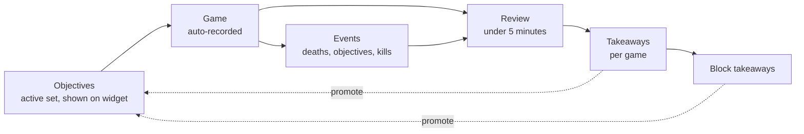
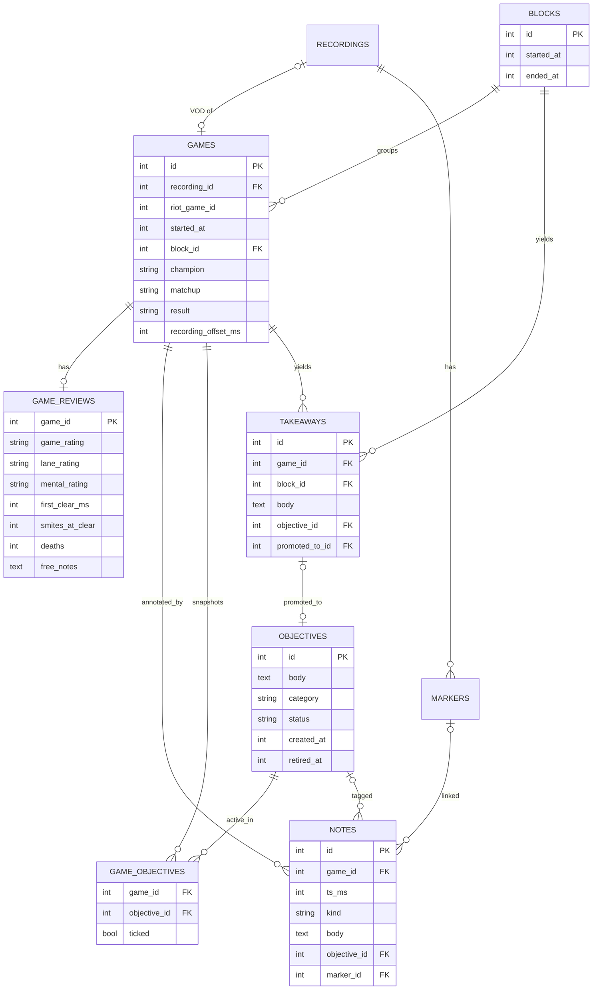
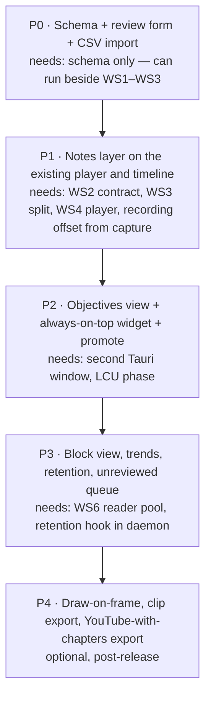

# WS9 — VOD review and note-taking

> Additive to the [v2 implementation plan](../implementation/v2-implementation-plan.md), under [ADR 0004](../decisions/0004-add-ws9-vod-review.md). Not a v2.0.0 or v2.1.0 gate.

| | |
|---|---|
| **Gated by** | P0: the schema only. P1 onward: WS2, WS3, WS4 and WS6 |
| **Rough effort** | Not estimated |
| **Status** | P0 landed (2026-09-26) |

The P0 implementation brief is [`../briefs/ws9-p0.md`](../briefs/ws9-p0.md).

## Adapted to the tree

This specification was drafted as "WS8" against a generic schema. It was
adapted before filing, and the adaptations are recorded here rather than
silently applied, so a reader holding the draft can see what moved and why.

| Draft said | This file says | Why |
|---|---|---|
| WS8 | **WS9** | WS8 is the libobs removal and relicense (§5 of the plan). |
| Depends on WS4 (JSON-RPC transport), WS5 (daemon/UI split), WS6 | WS2 (contract), WS3 (pipe transport and daemon/UI split), WS4 (Svelte), WS6 (reader pool) | The draft's numbers did not match the plan's. All four have landed on `ninja-recorder` `main`. |
| Extends an existing `game` row | **A new `games` table** | There is no `game` table. `recordings` is the closest thing, and a `recordings` row is deleted when its file goes: by `db::reconcile`, by retention, and by the user's Delete. A review hung off it would cascade away with the VOD, which §4.4 plans to delete on purpose, and the §3.2 importer could not create a game that was never recorded. A `games` row is the match; it outlives its VOD and links to it through a nullable `recording_id`. |
| New `game_event` table | **Reuse `markers`** | Open question 2 answered: the Live Client poller already persists events as `markers`, with `payload_json` holding the raw event and `video_time_s` holding the seekable position. A second table would duplicate it. |
| Singular table names (`block`, `note`, …) | Plural (`blocks`, `notes`, …) | The existing schema is plural: `recordings`, `markers`, `samples`. |
| P1 builds a player and an event timeline | P1 **extends** the existing Review view | WS4 already landed a player island, a marker timeline and review hotkeys (`src/lib/review/`, `src/lib/timeline/`). |

## 1. Purpose

Replace the current spreadsheet + YouTube + Windows Sticky Notes workflow with an in-app review loop that owns the VOD file, the game metadata and the notes together.

The spreadsheet encodes a loop, not a table:

- **Learning objectives** are a persistent set copied into every game row until they change.
- **Key takeaways** are per game; the good ones become the next objectives.
- **Block takeaways** summarise a session of games.
- Sticky Notes is the "currently active objectives" surface.

WS9 makes each step of that loop one action inside the app.



## 2. Prior art surveyed

| Tool | What to borrow | What to avoid |
|---|---|---|
| Insights.gg | Auto event detection on a timeline; timestamped comments; draw-on-frame | Cloud upload as the only path to review |
| RiftRec | "Today's objective" on the home screen; win/loss cards with KDA and matchup; event-marked timeline; notes and match context beside the video | Cloud rooms as the core |
| Replays.lol | Auto-bookmarking key moments so review starts from markers, not from 0:00 | — |
| thieu-le/lol-vod-review | Store raw Live Client events verbatim, derive structured `match_events` deterministically; store the recording-start ↔ game-clock offset | YouTube upload as the storage layer |
| weteachleague "How to Review 101" | Reviews under five minutes, scoped to the current learning objective | — |

Gap nobody fills: objective → game → takeaway → block → promote loop, plus a desktop surface for active objectives. That is the product.

## 3. Data model

New tables alongside `recordings` and `markers`. The writer is daemon-owned, as for every other table; the UI reads through its `query_only` connection and writes over the pipe.



Times are unix milliseconds, as in `recordings.started_at`.

### 3.1 Table notes

- `games` — one row per played match. Written at game start, next to `begin_recording`, and completed at finalize from the recording's champion, result and scoreboard. `recording_id` references `recordings(id)` `ON DELETE SET NULL`: deleting a VOD leaves the game, its review and its takeaways in place. The §3.2 importer creates rows with no recording at all. `riot_game_id` is unique when present and is how a finished recording and the importer find an existing game.
- `blocks` — a session. Auto-created when a game starts more than 2 hours after the previous game ended (configurable). User can split/merge. Block takeaways are `takeaways` rows with `block_id` set and `game_id` null.
- `games.recording_offset_ms` — recording start relative to game clock zero. Every marker's `game_time_s` converts to a seekable position with it. `markers.video_time_s` already carries that position per row; the column exists so a game whose markers are gone can still be aligned, and P1 fills it.
- `game_reviews` — 1:1 with `games`. Ratings are enums: `game_rating ∈ {win, loss}`, `lane_rating ∈ {win, neutral, loss}`, `mental_rating ∈ {good, neutral, bad}`. `deaths` is prefilled from the recording's `death` markers and editable. `first_clear_ms` / `smites_at_clear` are user-entered in P0 (see open questions).
- `markers` — existing, unchanged. Kinds today are `kill`, `death`, `assist`, `dragon`, `baron`, `herald`, `voidgrubs`, `turret`, `inhibitor`, `ace`, `first_blood` and `custom`; `payload_json` holds the Live Client payload verbatim so rows can be re-derived if the parser changes.
- `notes` — timestamped, `kind ∈ {mistake, good, question, takeaway}`. Optional link to an objective and/or the marker it sits on (`marker_id`, `ON DELETE SET NULL`).
- `objectives` — `status ∈ {active, paused, retired}`, `category ∈ {macro, lane, mental, mechanics, other}`.
- `game_objectives` — snapshot of which objectives were active when the game started, so retiring an objective later doesn't rewrite history. `ticked` = "I did this in this game".
- `takeaways` — exactly one of `game_id` / `block_id` non-null (CHECK constraint). `promoted_to_id` links to the objective it became.

### 3.2 Migration from the spreadsheet

One-off CSV importer:

- Each spreadsheet row → `games` (matched to an existing game by start time within ±5 min, else created with no recording) + `game_reviews`.
- Distinct Learning Objectives text → `objectives` rows (deduped by normalised text), linked via `game_objectives`.
- Key Takeaways bullets → `takeaways` rows.
- Block Takeaways → `takeaways` with `block_id`.

## 4. UI surfaces

### 4.1 Review screen (P1)

```text
┌──────────────────────────────────────────────┬─────────────────────────┐
│ Game 1 · Wed 16/09 5:23pm  [Loss]  Jgl vs X  │  Review timer 3:12/5:00 │
├──────────────────────────────────────────────┼─────────────────────────┤
│                                              │ Ratings                 │
│              <video (local file)>            │ [Game][Lane][Mental]    │
│                                              │ Clear 2:58 · 1 smite    │
│                                              │ Deaths 7 (auto)         │
├──────────────────────────────────────────────┤─────────────────────────┤
│ ▶ 12:41 ━━━●━━━━━━━━━━━━━━━━━━━━━ 31:06 1.5x │ Reviewing against       │
│   ● death  ● objective  | note               │ [x] objective 1         │
├──────────────────────────────────────────────┤ [ ] objective 2         │
│ 4:18  mistake  Contested grubs no prio…      │ [x] objective 3         │
│ 14:52 good     Took small win top, rotated…  ├─────────────────────────┤
│ 12:41 (N to add note at this timestamp)      │ Takeaways               │
│                                              │ "…"          [Promote ↑]│
│                                              │ [ add a takeaway ]      │
└──────────────────────────────────────────────┴─────────────────────────┘
```

- Playback: the existing Review player — local MP4, no transcode, no upload.
- Timeline layers: the existing marker timeline plus user notes. Click marker → seek.
- Hotkeys: `N` pause + note at current ts; `M` / `G` / `?` note with kind preset; `←`/`→` ±5s; `S` cycle speed; `Esc` close note editor. Merge with the existing review hotkeys rather than replacing them.
- Right rail order is deliberate: ratings (fast), objectives checklist (review *against* them), takeaways (output). Review timer nudges the five-minute habit.

### 4.2 Objectives view and desktop widget (P2)

- Main view: active objectives with evidence (linked notes/takeaways across games), games-active count, pause/retire.
- Widget: second Tauri window — `alwaysOnTop: true`, `decorations: false`, `transparent: true`, draggable, remembers position. Renders only the active objectives. Optional auto-show on LCU phase `ChampSelect`/`Lobby`, hide on `InProgress`. No injection; Vanguard-safe.

### 4.3 Block view (P3)

Games grouped by block using the same colour-coded rating cells as the spreadsheet, block takeaways beneath, per-block summary (deaths trend, mental distribution). Home screen gets an "unreviewed games" queue.

### 4.4 Retention (P3)

Review state drives retention:

| VOD state | Policy |
|---|---|
| Has notes or a takeaway | Keep |
| Reviewed, nothing notable | Delete after 7 days |
| Unreviewed | Delete after 30 days, warn in queue at 23 |

This replaces YouTube as the archive. Deleting a VOD deletes its `recordings` row and markers, and leaves the `games` row and everything hung off it. YouTube export with chapters generated from markers is an opt-in P4 export, not a dependency.

## 5. Phasing



P0 is a parallel track: it only touches the schema, the review form and the importer, and it already replaces the spreadsheet. P1 onward builds on the contract, process-split, Svelte and SQLite workstreams, all of which have landed.

## 6. Open questions (record, don't resolve)

These are Q7–Q11 in §9 of the plan.

1. **Clear time derivation.** Live Client events don't include camp kills. Candidates: hotkey at end of clear; level-4 timestamp as a proxy; gold-delta heuristic. P0 ships manual entry.
2. **Does an event table already exist in the v2 schema?** *Answered while filing:* yes, `markers`. It already carries the raw payload and the video position; see "Adapted to the tree".
3. **Block boundary rule.** 2-hour gap is a guess; may want "same day" or manual only.
4. **Note body format.** Plain text + `kind` tag, or rich text? P0/P1 assume plain text.
5. **Widget in-game.** Whether to keep the always-on-top window visible during a match (borderless fullscreen shows it; exclusive fullscreen won't).

## Status

- [x] **P0** — Schema, review form, objectives list, CSV import. Landed on
  `ninja-recorder` `main` as NinjaGoldfinch/ninja-recorder#266 (schema), NinjaGoldfinch/ninja-recorder#267 (`Db` methods and the
  supervisor hooks), NinjaGoldfinch/ninja-recorder#271 (contract), NinjaGoldfinch/ninja-recorder#273 (review form and Objectives view)
  and NinjaGoldfinch/ninja-recorder#274 (spreadsheet import); tracked in NinjaGoldfinch/ninja-recorder#262. The review form is its own
  view in P0, and the CSV is parsed in the webview so the local timezone
  converts its dates. Neither has been checked in a running window yet.
- [ ] **P1** — Notes layer on the Review view
- [ ] **P2** — Objectives view, widget, promote
- [ ] **P3** — Block view, trends, review-driven retention, unreviewed queue
- [ ] **P4** — Draw-on-frame, clip export, YouTube export
